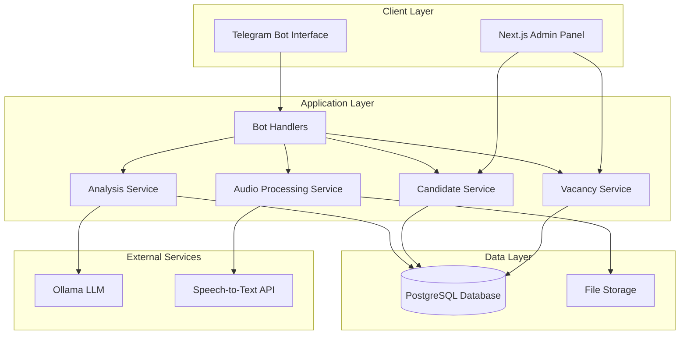

# Design Document

## Overview

The AI HR Bot system is designed as a microservices architecture that transforms the existing basic Telegram bot into a comprehensive recruitment platform. The system integrates multiple components: a Telegram bot interface, PostgreSQL database, LLM-powered analysis engine, audio processing capabilities, and a Next.js admin panel.

The architecture follows a modular approach where each component has clearly defined responsibilities and communicates through well-defined APIs. This design ensures scalability, maintainability, and the ability to extend functionality in the future.

## Architecture

### High-Level Architecture



### Component Architecture

The system is organized into distinct layers:

1. **Presentation Layer**: Telegram Bot and Admin Panel interfaces
2. **Business Logic Layer**: Core services handling domain logic
3. **Data Access Layer**: Database repositories and file storage
4. **Integration Layer**: External service connectors

## Components and Interfaces

### Database Schema

```sql
-- Vacancies table
CREATE TABLE vacancies (
    id SERIAL PRIMARY KEY,
    title VARCHAR(255) NOT NULL,
    description TEXT NOT NULL,
    requirements JSONB NOT NULL,
    evaluation_weights JSONB NOT NULL,
    status VARCHAR(50) DEFAULT 'active',
    created_at TIMESTAMP DEFAULT CURRENT_TIMESTAMP,
    updated_at TIMESTAMP DEFAULT CURRENT_TIMESTAMP
);

-- Candidates table
CREATE TABLE candidates (
    id SERIAL PRIMARY KEY,
    telegram_user_id BIGINT UNIQUE NOT NULL,
    first_name VARCHAR(255),
    last_name VARCHAR(255),
    username VARCHAR(255),
    created_at TIMESTAMP DEFAULT CURRENT_TIMESTAMP
);

-- Dialogues table
CREATE TABLE dialogues (
    id SERIAL PRIMARY KEY,
    candidate_id INTEGER REFERENCES candidates(id),
    vacancy_id INTEGER REFERENCES vacancies(id),
    message_type VARCHAR(50) NOT NULL, -- 'text', 'audio', 'system'
    content TEXT,
    audio_file_path VARCHAR(500),
    transcription TEXT,
    sender VARCHAR(50) NOT NULL, -- 'candidate', 'bot'
    created_at TIMESTAMP DEFAULT CURRENT_TIMESTAMP
);

-- Evaluations table
CREATE TABLE evaluations (
    id SERIAL PRIMARY KEY,
    candidate_id INTEGER REFERENCES candidates(id),
    vacancy_id INTEGER REFERENCES vacancies(id),
    overall_score INTEGER,
    technical_score INTEGER,
    communication_score INTEGER,
    problem_solving_score INTEGER,
    strengths TEXT[],
    gaps TEXT[],
    contradictions TEXT[],
    recommendation VARCHAR(50), -- 'proceed', 'reject', 'clarify'
    feedback TEXT,
    analysis_data JSONB,
    created_at TIMESTAMP DEFAULT CURRENT_TIMESTAMP
);
```

### Core Services

#### VacancyService
```typescript
interface VacancyService {
    createVacancy(vacancy: CreateVacancyDto): Promise<Vacancy>;
    getActiveVacancies(): Promise<Vacancy[]>;
    getVacancyById(id: number): Promise<Vacancy | null>;
    updateVacancy(id: number, updates: UpdateVacancyDto): Promise<Vacancy>;
    deactivateVacancy(id: number): Promise<void>;
}

interface Vacancy {
    id: number;
    title: string;
    description: string;
    requirements: VacancyRequirements;
    evaluationWeights: EvaluationWeights;
    status: 'active' | 'inactive';
    createdAt: Date;
    updatedAt: Date;
}

interface EvaluationWeights {
    technicalSkills: number; // 0-100, default 50
    communication: number;   // 0-100, default 30
    problemSolving: number;  // 0-100, default 20
}
```

#### CandidateService
```typescript
interface CandidateService {
    createOrUpdateCandidate(telegramUser: TelegramUser): Promise<Candidate>;
    getCandidateByTelegramId(telegramUserId: number): Promise<Candidate | null>;
    getCandidateDialogues(candidateId: number, vacancyId?: number): Promise<Dialogue[]>;
    addDialogue(dialogue: CreateDialogueDto): Promise<Dialogue>;
}

interface Candidate {
    id: number;
    telegramUserId: number;
    firstName?: string;
    lastName?: string;
    username?: string;
    createdAt: Date;
}
```

#### AnalysisService
```typescript
interface AnalysisService {
    analyzeCandidate(candidateId: number, vacancyId: number): Promise<Evaluation>;
    generateFeedback(evaluation: Evaluation): Promise<string>;
    extractSkillsFromText(text: string): Promise<string[]>;
}

interface Evaluation {
    id: number;
    candidateId: number;
    vacancyId: number;
    overallScore: number;
    technicalScore: number;
    communicationScore: number;
    problemSolvingScore: number;
    strengths: string[];
    gaps: string[];
    contradictions: string[];
    recommendation: 'proceed' | 'reject' | 'clarify';
    feedback: string;
    analysisData: Record<string, any>;
    createdAt: Date;
}
```

#### AudioProcessingService
```typescript
interface AudioProcessingService {
    processAudioMessage(audioBuffer: Buffer, fileId: string): Promise<AudioProcessingResult>;
    saveAudioFile(buffer: Buffer, filename: string): Promise<string>;
    transcribeAudio(filePath: string): Promise<string>;
}

interface AudioProcessingResult {
    filePath: string;
    transcription: string;
    duration?: number;
    confidence?: number;
}
```

### Admin Panel Architecture (Next.js + TypeScript + Tailwind)

The admin panel is built as a separate Next.js application with the following structure:

```
admin-panel/
├── src/
│   ├── app/                    # App Router (Next.js 13+)
│   │   ├── (auth)/
│   │   │   ├── login/
│   │   │   └── layout.tsx
│   │   ├── dashboard/
│   │   │   ├── page.tsx
│   │   │   └── layout.tsx
│   │   ├── vacancies/
│   │   │   ├── page.tsx
│   │   │   ├── [id]/
│   │   │   ├── create/
│   │   │   └── edit/[id]/
│   │   ├── candidates/
│   │   │   ├── page.tsx
│   │   │   ├── [id]/
│   │   │   └── evaluations/
│   │   ├── reports/
│   │   │   ├── page.tsx
│   │   │   └── analytics/
│   │   ├── api/                # API Routes
│   │   │   ├── auth/
│   │   │   ├── vacancies/
│   │   │   ├── candidates/
│   │   │   └── evaluations/
│   │   ├── globals.css
│   │   └── layout.tsx
│   ├── components/
│   │   ├── ui/                 # Reusable UI components
│   │   │   ├── Button.tsx
│   │   │   ├── Card.tsx
│   │   │   ├── Modal.tsx
│   │   │   ├── Table.tsx
│   │   │   ├── Form.tsx
│   │   │   └── Charts.tsx
│   │   ├── layout/
│   │   │   ├── Sidebar.tsx
│   │   │   ├── Header.tsx
│   │   │   └── Navigation.tsx
│   │   ├── vacancies/
│   │   │   ├── VacancyForm.tsx
│   │   │   ├── VacancyList.tsx
│   │   │   └── VacancyCard.tsx
│   │   ├── candidates/
│   │   │   ├── CandidateList.tsx
│   │   │   ├── CandidateProfile.tsx
│   │   │   └── EvaluationReport.tsx
│   │   └── dashboard/
│   │       ├── StatsCards.tsx
│   │       ├── RecentActivity.tsx
│   │       └── Charts.tsx
│   ├── lib/
│   │   ├── api.ts              # API client
│   │   ├── auth.ts             # Authentication utilities
│   │   ├── utils.ts            # Utility functions
│   │   └── validations.ts      # Form validation schemas
│   ├── types/
│   │   ├── api.ts              # API response types
│   │   ├── auth.ts             # Authentication types
│   │   └── models.ts           # Data model types
│   └── hooks/
│       ├── useAuth.ts
│       ├── useApi.ts
│       └── useLocalStorage.ts
├── public/
├── tailwind.config.js
├── next.config.js
└── package.json
```

#### Key Components Design

**Dashboard Layout**
```typescript
interface DashboardLayoutProps {
  children: React.ReactNode;
}

const DashboardLayout: React.FC<DashboardLayoutProps> = ({ children }) => {
  return (
    <div className="min-h-screen bg-gray-50">
      <Sidebar />
      <div className="lg:pl-64">
        <Header />
        <main className="py-6">
          <div className="mx-auto max-w-7xl px-4 sm:px-6 lg:px-8">
            {children}
          </div>
        </main>
      </div>
    </div>
  );
};
```

**Vacancy Management Interface**
```typescript
interface VacancyFormData {
  title: string;
  description: string;
  requirements: {
    technicalSkills: RequiredSkill[];
    experience: ExperienceRequirement[];
    education?: EducationRequirement[];
    softSkills: string[];
  };
  evaluationWeights: {
    technicalSkills: number;
    communication: number;
    problemSolving: number;
  };
  status: 'active' | 'inactive';
}

const VacancyForm: React.FC<VacancyFormProps> = ({ vacancy, onSubmit }) => {
  const [formData, setFormData] = useState<VacancyFormData>(defaultValues);
  
  return (
    <form onSubmit={handleSubmit} className="space-y-6">
      <Card className="p-6">
        <h3 className="text-lg font-medium mb-4">Basic Information</h3>
        <div className="grid grid-cols-1 gap-6">
          <Input
            label="Job Title"
            value={formData.title}
            onChange={(value) => setFormData({...formData, title: value})}
            required
          />
          <Textarea
            label="Job Description"
            value={formData.description}
            onChange={(value) => setFormData({...formData, description: value})}
            rows={4}
            required
          />
        </div>
      </Card>
      
      <Card className="p-6">
        <h3 className="text-lg font-medium mb-4">Requirements</h3>
        <SkillsEditor
          skills={formData.requirements.technicalSkills}
          onChange={(skills) => updateRequirements('technicalSkills', skills)}
        />
      </Card>
      
      <Card className="p-6">
        <h3 className="text-lg font-medium mb-4">Evaluation Weights</h3>
        <WeightSliders
          weights={formData.evaluationWeights}
          onChange={(weights) => setFormData({...formData, evaluationWeights: weights})}
        />
      </Card>
    </form>
  );
};
```

**Candidate Evaluation Dashboard**
```typescript
interface EvaluationReportProps {
  evaluation: Evaluation;
  candidate: Candidate;
  vacancy: Vacancy;
}

const EvaluationReport: React.FC<EvaluationReportProps> = ({ evaluation, candidate, vacancy }) => {
  return (
    <div className="space-y-6">
      <Card className="p-6">
        <div className="flex items-center justify-between mb-4">
          <h2 className="text-xl font-semibold">Candidate Evaluation</h2>
          <Badge variant={getRecommendationVariant(evaluation.recommendation)}>
            {evaluation.recommendation.toUpperCase()}
          </Badge>
        </div>
        
        <div className="grid grid-cols-1 md:grid-cols-3 gap-4 mb-6">
          <ScoreCard
            title="Overall Score"
            score={evaluation.overallScore}
            className="bg-blue-50 border-blue-200"
          />
          <ScoreCard
            title="Technical Skills"
            score={evaluation.technicalScore}
            className="bg-green-50 border-green-200"
          />
          <ScoreCard
            title="Communication"
            score={evaluation.communicationScore}
            className="bg-purple-50 border-purple-200"
          />
        </div>
        
        <div className="grid grid-cols-1 lg:grid-cols-2 gap-6">
          <div>
            <h3 className="font-medium text-gray-900 mb-2">Strengths</h3>
            <ul className="space-y-1">
              {evaluation.strengths.map((strength, index) => (
                <li key={index} className="flex items-center text-sm text-gray-600">
                  <CheckIcon className="h-4 w-4 text-green-500 mr-2" />
                  {strength}
                </li>
              ))}
            </ul>
          </div>
          
          <div>
            <h3 className="font-medium text-gray-900 mb-2">Areas for Improvement</h3>
            <ul className="space-y-1">
              {evaluation.gaps.map((gap, index) => (
                <li key={index} className="flex items-center text-sm text-gray-600">
                  <XMarkIcon className="h-4 w-4 text-red-500 mr-2" />
                  {gap}
                </li>
              ))}
            </ul>
          </div>
        </div>
      </Card>
      
      <Card className="p-6">
        <h3 className="font-medium text-gray-900 mb-4">Conversation History</h3>
        <ConversationTimeline dialogues={evaluation.dialogues} />
      </Card>
    </div>
  );
};
```

**Analytics Dashboard**
```typescript
const AnalyticsDashboard: React.FC = () => {
  const { data: analytics } = useAnalytics();
  
  return (
    <div className="space-y-6">
      <div className="grid grid-cols-1 md:grid-cols-2 lg:grid-cols-4 gap-4">
        <StatsCard
          title="Active Vacancies"
          value={analytics.activeVacancies}
          change={analytics.vacancyChange}
          icon={BriefcaseIcon}
        />
        <StatsCard
          title="Total Candidates"
          value={analytics.totalCandidates}
          change={analytics.candidateChange}
          icon={UsersIcon}
        />
        <StatsCard
          title="Interviews Completed"
          value={analytics.completedInterviews}
          change={analytics.interviewChange}
          icon={ChatBubbleLeftRightIcon}
        />
        <StatsCard
          title="Success Rate"
          value={`${analytics.successRate}%`}
          change={analytics.successRateChange}
          icon={TrophyIcon}
        />
      </div>
      
      <div className="grid grid-cols-1 lg:grid-cols-2 gap-6">
        <Card className="p-6">
          <h3 className="text-lg font-medium mb-4">Candidate Pipeline</h3>
          <PipelineChart data={analytics.pipelineData} />
        </Card>
        
        <Card className="p-6">
          <h3 className="text-lg font-medium mb-4">Evaluation Scores Distribution</h3>
          <ScoreDistributionChart data={analytics.scoreDistribution} />
        </Card>
      </div>
      
      <Card className="p-6">
        <h3 className="text-lg font-medium mb-4">Recent Activity</h3>
        <ActivityFeed activities={analytics.recentActivities} />
      </Card>
    </div>
  );
};
```

#### Tailwind CSS Design System

**Color Palette**
```css
/* Custom color scheme for HR system */
:root {
  --color-primary-50: #eff6ff;
  --color-primary-500: #3b82f6;
  --color-primary-600: #2563eb;
  --color-success-50: #f0fdf4;
  --color-success-500: #22c55e;
  --color-warning-50: #fffbeb;
  --color-warning-500: #f59e0b;
  --color-danger-50: #fef2f2;
  --color-danger-500: #ef4444;
}
```

**Component Styling Patterns**
```typescript
// Button variants using Tailwind classes
const buttonVariants = {
  primary: "bg-blue-600 hover:bg-blue-700 text-white",
  secondary: "bg-gray-200 hover:bg-gray-300 text-gray-900",
  success: "bg-green-600 hover:bg-green-700 text-white",
  danger: "bg-red-600 hover:bg-red-700 text-white",
};

// Card component with consistent styling
const Card: React.FC<CardProps> = ({ children, className = "" }) => {
  return (
    <div className={`bg-white rounded-lg border border-gray-200 shadow-sm ${className}`}>
      {children}
    </div>
  );
};
```

### Bot Handler Architecture

The bot handlers are redesigned to support the new workflow:

```typescript
class BotHandlers {
    private vacancyService: VacancyService;
    private candidateService: CandidateService;
    private analysisService: AnalysisService;
    private audioService: AudioProcessingService;
    
    // State management for conversation flow
    private userStates: Map<number, UserState>;
    
    async handleStart(msg: Message): Promise<void>;
    async handleVacancySelection(query: CallbackQuery): Promise<void>;
    async handleTextMessage(msg: Message): Promise<void>;
    async handleAudioMessage(msg: Message): Promise<void>;
    async handleEvaluationComplete(candidateId: number, vacancyId: number): Promise<void>;
}

interface UserState {
    currentVacancyId?: number;
    stage: 'selecting_vacancy' | 'interviewing' | 'completed';
    questionCount: number;
    lastActivity: Date;
}
```

## Data Models

### Vacancy Requirements Structure
```typescript
interface VacancyRequirements {
    technicalSkills: RequiredSkill[];
    experience: ExperienceRequirement[];
    education?: EducationRequirement[];
    languages?: LanguageRequirement[];
    softSkills: string[];
}

interface RequiredSkill {
    name: string;
    level: 'beginner' | 'intermediate' | 'advanced' | 'expert';
    mandatory: boolean;
    weight: number; // 1-10
}

interface ExperienceRequirement {
    domain: string;
    minimumYears: number;
    preferred: boolean;
}
```

### Analysis Data Structure
```typescript
interface AnalysisData {
    extractedSkills: ExtractedSkill[];
    experienceAnalysis: ExperienceAnalysis;
    communicationMetrics: CommunicationMetrics;
    redFlags: RedFlag[];
    matchingResults: MatchingResult[];
}

interface ExtractedSkill {
    name: string;
    confidence: number;
    evidence: string[];
    level?: 'beginner' | 'intermediate' | 'advanced' | 'expert';
}

interface CommunicationMetrics {
    clarity: number; // 1-10
    completeness: number; // 1-10
    relevance: number; // 1-10
    professionalTone: number; // 1-10
}
```

## Error Handling

### Error Categories and Responses

1. **Database Errors**
   - Connection failures: Retry with exponential backoff
   - Query errors: Log and return user-friendly messages
   - Transaction failures: Rollback and retry

2. **External Service Errors**
   - Ollama API failures: Fallback to simpler analysis
   - Speech-to-Text failures: Request text input
   - Telegram API errors: Queue messages for retry

3. **Validation Errors**
   - Invalid input: Provide specific guidance
   - Missing data: Request required information
   - Format errors: Show examples

### Error Handling Strategy

```typescript
class ErrorHandler {
    static async handleDatabaseError(error: DatabaseError, context: string): Promise<void>;
    static async handleExternalServiceError(error: ServiceError, fallback?: () => Promise<any>): Promise<any>;
    static async handleValidationError(error: ValidationError): Promise<string>;
}

interface ErrorResponse {
    success: false;
    error: {
        code: string;
        message: string;
        details?: any;
    };
}
```

## Testing Strategy

### Unit Testing
- Service layer methods with mocked dependencies
- Data validation and transformation functions
- Error handling scenarios
- Business logic components

### Integration Testing
- Database operations with test database
- External API integrations with mock services
- End-to-end conversation flows
- File upload and processing workflows

### Test Structure
```typescript
describe('VacancyService', () => {
    describe('createVacancy', () => {
        it('should create vacancy with valid data');
        it('should validate required fields');
        it('should handle database errors');
    });
});

describe('Bot Integration', () => {
    it('should handle complete interview flow');
    it('should process audio messages correctly');
    it('should generate appropriate evaluations');
});
```

### Performance Testing
- Database query optimization
- Large file processing capabilities
- Concurrent user handling
- Memory usage monitoring

### Security Testing
- Input validation and sanitization
- SQL injection prevention
- Authentication and authorization
- Data encryption verification

## Configuration Management

### Environment Variables
```typescript
interface Config {
    database: {
        host: string;
        port: number;
        name: string;
        username: string;
        password: string;
        ssl: boolean;
    };
    telegram: {
        token: string;
        webhookUrl?: string;
    };
    ollama: {
        baseUrl: string;
        model: string;
        timeout: number;
    };
    speechToText: {
        provider: 'google' | 'azure' | 'aws';
        apiKey: string;
        region?: string;
    };
    storage: {
        audioFilesPath: string;
        maxFileSize: number;
    };
    admin: {
        jwtSecret: string;
        sessionTimeout: number;
    };
}
```

This design provides a robust foundation for implementing the comprehensive AI HR Bot system while maintaining the existing codebase structure and extending it with the required functionality.