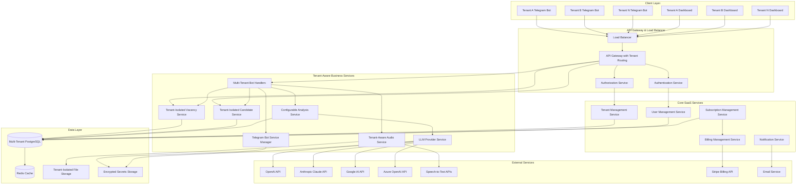
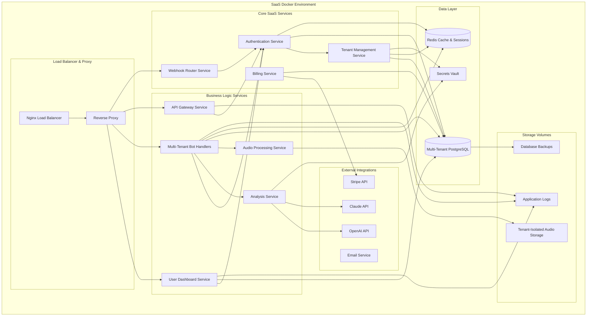

# Design Document

## Overview

The AI HR Bot system is designed as a **multi-tenant SaaS platform** with microservices architecture that provides comprehensive recruitment solutions to multiple customers. Each customer operates in a completely isolated environment with their own:

- **Individual Dashboard**: Personalized web interface for managing recruitment operations
- **Custom Telegram Bot Integration**: Personal bot token configuration for branded candidate interactions
- **Configurable LLM Processing**: Choice of AI providers (OpenAI, Anthropic, Google, Azure) with secure credential management
- **Complete Data Isolation**: Tenant-specific data storage with row-level security
- **Subscription Management**: Flexible pricing tiers with usage-based billing

The platform integrates multiple components: tenant-aware Telegram bot handlers, PostgreSQL database with multi-tenant schema, configurable LLM analysis engines, audio processing capabilities, individual user dashboards, authentication/authorization systems, and subscription management.

The architecture follows a modular, tenant-aware approach where each component enforces data isolation and communicates through well-defined, secured APIs. This design ensures scalability, maintainability, security, and the ability to serve multiple customers simultaneously.

## Architecture

### High-Level SaaS Multi-Tenant Architecture



### Multi-Tenant Component Architecture

The SaaS platform is organized into distinct layers with tenant isolation:

1. **Client Layer**: Multiple tenant-specific Telegram bots and individual user dashboards
2. **API Gateway Layer**: Load balancing, tenant routing, authentication, and authorization
3. **SaaS Management Layer**: Tenant management, user management, subscription, and billing services
4. **Business Logic Layer**: Tenant-aware core services with data isolation
5. **Data Access Layer**: Multi-tenant database with row-level security and tenant-isolated file storage
6. **Integration Layer**: Configurable external service connectors (LLM providers, payment systems)

#### Key Architectural Principles

- **Tenant Isolation**: Complete data separation between customers
- **Configurable Services**: Each tenant can configure their own LLM providers and settings
- **Scalable Authentication**: JWT-based authentication with tenant context
- **Secure Credential Management**: Encrypted storage of tenant-specific API keys
- **Usage Tracking**: Comprehensive billing and analytics per tenant
- **High Availability**: Load balancing and service redundancy

## Components and Interfaces

### Multi-Tenant Database Schema

```sql
-- Tenants table - Core SaaS entity
CREATE TABLE tenants (
    id UUID PRIMARY KEY DEFAULT gen_random_uuid(),
    name VARCHAR(255) NOT NULL,
    slug VARCHAR(100) UNIQUE NOT NULL,
    status VARCHAR(50) DEFAULT 'active', -- 'active', 'suspended', 'cancelled'
    subscription_tier VARCHAR(50) DEFAULT 'starter', -- 'starter', 'professional', 'enterprise'
    settings JSONB DEFAULT '{}',
    created_at TIMESTAMP DEFAULT CURRENT_TIMESTAMP,
    updated_at TIMESTAMP DEFAULT CURRENT_TIMESTAMP
);

-- Users table - SaaS platform users (customers)
CREATE TABLE users (
    id UUID PRIMARY KEY DEFAULT gen_random_uuid(),
    tenant_id UUID NOT NULL REFERENCES tenants(id) ON DELETE CASCADE,
    email VARCHAR(255) UNIQUE NOT NULL,
    password_hash VARCHAR(255) NOT NULL,
    first_name VARCHAR(255),
    last_name VARCHAR(255),
    role VARCHAR(50) DEFAULT 'owner', -- 'owner', 'admin', 'viewer'
    email_verified BOOLEAN DEFAULT FALSE,
    last_login TIMESTAMP,
    created_at TIMESTAMP DEFAULT CURRENT_TIMESTAMP,
    updated_at TIMESTAMP DEFAULT CURRENT_TIMESTAMP
);

-- Tenant configurations
CREATE TABLE tenant_configurations (
    id UUID PRIMARY KEY DEFAULT gen_random_uuid(),
    tenant_id UUID NOT NULL REFERENCES tenants(id) ON DELETE CASCADE,
    telegram_bot_token VARCHAR(500),
    telegram_webhook_url VARCHAR(500),
    llm_provider VARCHAR(50), -- 'openai', 'claude', 'google', 'azure'
    llm_model VARCHAR(100),
    llm_api_key_encrypted TEXT,
    llm_settings JSONB DEFAULT '{}',
    speech_to_text_provider VARCHAR(50),
    speech_to_text_api_key_encrypted TEXT,
    evaluation_weights JSONB DEFAULT '{"technical_skills": 50, "communication": 30, "problem_solving": 20}',
    created_at TIMESTAMP DEFAULT CURRENT_TIMESTAMP,
    updated_at TIMESTAMP DEFAULT CURRENT_TIMESTAMP,
    UNIQUE(tenant_id)
);

-- Vacancies table with tenant isolation
CREATE TABLE vacancies (
    id UUID PRIMARY KEY DEFAULT gen_random_uuid(),
    tenant_id UUID NOT NULL REFERENCES tenants(id) ON DELETE CASCADE,
    title VARCHAR(255) NOT NULL,
    description TEXT NOT NULL,
    requirements JSONB NOT NULL,
    evaluation_weights JSONB NOT NULL,
    status VARCHAR(50) DEFAULT 'active',
    created_by UUID REFERENCES users(id),
    created_at TIMESTAMP DEFAULT CURRENT_TIMESTAMP,
    updated_at TIMESTAMP DEFAULT CURRENT_TIMESTAMP
);

-- Candidates table with tenant isolation
CREATE TABLE candidates (
    id UUID PRIMARY KEY DEFAULT gen_random_uuid(),
    tenant_id UUID NOT NULL REFERENCES tenants(id) ON DELETE CASCADE,
    telegram_user_id BIGINT NOT NULL,
    first_name VARCHAR(255),
    last_name VARCHAR(255),
    username VARCHAR(255),
    phone_number VARCHAR(50),
    email VARCHAR(255),
    created_at TIMESTAMP DEFAULT CURRENT_TIMESTAMP,
    UNIQUE(tenant_id, telegram_user_id)
);

-- Dialogues table with tenant isolation
CREATE TABLE dialogues (
    id UUID PRIMARY KEY DEFAULT gen_random_uuid(),
    tenant_id UUID NOT NULL REFERENCES tenants(id) ON DELETE CASCADE,
    candidate_id UUID NOT NULL REFERENCES candidates(id) ON DELETE CASCADE,
    vacancy_id UUID NOT NULL REFERENCES vacancies(id) ON DELETE CASCADE,
    message_type VARCHAR(50) NOT NULL, -- 'text', 'audio', 'system'
    content TEXT,
    audio_file_path VARCHAR(500),
    transcription TEXT,
    sender VARCHAR(50) NOT NULL, -- 'candidate', 'bot'
    created_at TIMESTAMP DEFAULT CURRENT_TIMESTAMP
);

-- Evaluations table with tenant isolation
CREATE TABLE evaluations (
    id UUID PRIMARY KEY DEFAULT gen_random_uuid(),
    tenant_id UUID NOT NULL REFERENCES tenants(id) ON DELETE CASCADE,
    candidate_id UUID NOT NULL REFERENCES candidates(id) ON DELETE CASCADE,
    vacancy_id UUID NOT NULL REFERENCES vacancies(id) ON DELETE CASCADE,
    overall_score INTEGER,
    technical_score INTEGER,
    communication_score INTEGER,
    problem_solving_score INTEGER,
    strengths TEXT[],
    gaps TEXT[],
    contradictions TEXT[],
    recommendation VARCHAR(50), -- 'proceed', 'reject', 'clarify'
    feedback TEXT,
    analysis_data JSONB,
    llm_provider_used VARCHAR(50),
    processing_time_ms INTEGER,
    created_at TIMESTAMP DEFAULT CURRENT_TIMESTAMP
);

-- Subscriptions table
CREATE TABLE subscriptions (
    id UUID PRIMARY KEY DEFAULT gen_random_uuid(),
    tenant_id UUID NOT NULL REFERENCES tenants(id) ON DELETE CASCADE,
    plan_name VARCHAR(100) NOT NULL,
    status VARCHAR(50) DEFAULT 'active', -- 'active', 'cancelled', 'past_due'
    current_period_start TIMESTAMP NOT NULL,
    current_period_end TIMESTAMP NOT NULL,
    stripe_subscription_id VARCHAR(255),
    stripe_customer_id VARCHAR(255),
    created_at TIMESTAMP DEFAULT CURRENT_TIMESTAMP,
    updated_at TIMESTAMP DEFAULT CURRENT_TIMESTAMP
);

-- Usage tracking for billing
CREATE TABLE usage_metrics (
    id UUID PRIMARY KEY DEFAULT gen_random_uuid(),
    tenant_id UUID NOT NULL REFERENCES tenants(id) ON DELETE CASCADE,
    metric_type VARCHAR(50) NOT NULL, -- 'llm_calls', 'audio_processing', 'storage_mb'
    metric_value INTEGER NOT NULL,
    period_start DATE NOT NULL,
    period_end DATE NOT NULL,
    created_at TIMESTAMP DEFAULT CURRENT_TIMESTAMP,
    UNIQUE(tenant_id, metric_type, period_start)
);

-- Row Level Security Policies
ALTER TABLE tenants ENABLE ROW LEVEL SECURITY;
ALTER TABLE users ENABLE ROW LEVEL SECURITY;
ALTER TABLE tenant_configurations ENABLE ROW LEVEL SECURITY;
ALTER TABLE vacancies ENABLE ROW LEVEL SECURITY;
ALTER TABLE candidates ENABLE ROW LEVEL SECURITY;
ALTER TABLE dialogues ENABLE ROW LEVEL SECURITY;
ALTER TABLE evaluations ENABLE ROW LEVEL SECURITY;
ALTER TABLE subscriptions ENABLE ROW LEVEL SECURITY;
ALTER TABLE usage_metrics ENABLE ROW LEVEL SECURITY;

-- RLS Policies (example for vacancies)
CREATE POLICY tenant_isolation_policy ON vacancies
    USING (tenant_id = current_setting('app.current_tenant_id')::UUID);

-- Indexes for performance
CREATE INDEX idx_users_tenant_id ON users(tenant_id);
CREATE INDEX idx_vacancies_tenant_id ON vacancies(tenant_id);
CREATE INDEX idx_candidates_tenant_id ON candidates(tenant_id);
CREATE INDEX idx_candidates_tenant_telegram ON candidates(tenant_id, telegram_user_id);
CREATE INDEX idx_dialogues_tenant_id ON dialogues(tenant_id);
CREATE INDEX idx_dialogues_candidate_vacancy ON dialogues(candidate_id, vacancy_id);
CREATE INDEX idx_evaluations_tenant_id ON evaluations(tenant_id);
CREATE INDEX idx_usage_metrics_tenant_period ON usage_metrics(tenant_id, period_start);
```

### SaaS Core Services

#### TenantService
```typescript
interface TenantService {
    createTenant(tenantData: CreateTenantDto): Promise<Tenant>;
    getTenantById(tenantId: string): Promise<Tenant | null>;
    getTenantBySlug(slug: string): Promise<Tenant | null>;
    updateTenant(tenantId: string, updates: UpdateTenantDto): Promise<Tenant>;
    suspendTenant(tenantId: string): Promise<void>;
    deleteTenant(tenantId: string): Promise<void>;
    getTenantConfiguration(tenantId: string): Promise<TenantConfiguration>;
    updateTenantConfiguration(tenantId: string, config: UpdateTenantConfigDto): Promise<TenantConfiguration>;
}

interface Tenant {
    id: string;
    name: string;
    slug: string;
    status: 'active' | 'suspended' | 'cancelled';
    subscriptionTier: 'starter' | 'professional' | 'enterprise';
    settings: Record<string, any>;
    createdAt: Date;
    updatedAt: Date;
}

interface TenantConfiguration {
    id: string;
    tenantId: string;
    telegramBotToken?: string;
    telegramWebhookUrl?: string;
    llmProvider: 'openai' | 'claude' | 'google' | 'azure';
    llmModel: string;
    llmApiKeyEncrypted?: string;
    llmSettings: Record<string, any>;
    speechToTextProvider: string;
    speechToTextApiKeyEncrypted?: string;
    evaluationWeights: EvaluationWeights;
    createdAt: Date;
    updatedAt: Date;
}
```

#### UserService
```typescript
interface UserService {
    createUser(userData: CreateUserDto): Promise<User>;
    getUserById(userId: string): Promise<User | null>;
    getUserByEmail(email: string): Promise<User | null>;
    getUsersByTenantId(tenantId: string): Promise<User[]>;
    updateUser(userId: string, updates: UpdateUserDto): Promise<User>;
    deleteUser(userId: string): Promise<void>;
    verifyEmail(userId: string, token: string): Promise<boolean>;
    resetPassword(email: string): Promise<void>;
    changePassword(userId: string, currentPassword: string, newPassword: string): Promise<void>;
}

interface User {
    id: string;
    tenantId: string;
    email: string;
    firstName?: string;
    lastName?: string;
    role: 'owner' | 'admin' | 'viewer';
    emailVerified: boolean;
    lastLogin?: Date;
    createdAt: Date;
    updatedAt: Date;
}
```

#### Tenant-Aware VacancyService
```typescript
interface VacancyService {
    createVacancy(tenantId: string, vacancy: CreateVacancyDto): Promise<Vacancy>;
    getActiveVacancies(tenantId: string): Promise<Vacancy[]>;
    getVacancyById(tenantId: string, vacancyId: string): Promise<Vacancy | null>;
    updateVacancy(tenantId: string, vacancyId: string, updates: UpdateVacancyDto): Promise<Vacancy>;
    deactivateVacancy(tenantId: string, vacancyId: string): Promise<void>;
    getVacancyAnalytics(tenantId: string, vacancyId: string): Promise<VacancyAnalytics>;
}

interface Vacancy {
    id: string;
    tenantId: string;
    title: string;
    description: string;
    requirements: VacancyRequirements;
    evaluationWeights: EvaluationWeights;
    status: 'active' | 'inactive';
    createdBy: string;
    createdAt: Date;
    updatedAt: Date;
}

interface EvaluationWeights {
    technicalSkills: number; // 0-100, default 50
    communication: number;   // 0-100, default 30
    problemSolving: number;  // 0-100, default 20
}

interface VacancyAnalytics {
    totalCandidates: number;
    averageScore: number;
    recommendationDistribution: Record<string, number>;
    topSkillsFound: string[];
    commonGaps: string[];
}
```

#### Tenant-Aware CandidateService
```typescript
interface CandidateService {
    createOrUpdateCandidate(tenantId: string, telegramUser: TelegramUser): Promise<Candidate>;
    getCandidateByTelegramId(tenantId: string, telegramUserId: number): Promise<Candidate | null>;
    getCandidatesByTenantId(tenantId: string, page?: number, limit?: number): Promise<PaginatedResult<Candidate>>;
    getCandidateDialogues(tenantId: string, candidateId: string, vacancyId?: string): Promise<Dialogue[]>;
    addDialogue(tenantId: string, dialogue: CreateDialogueDto): Promise<Dialogue>;
    getCandidateAnalytics(tenantId: string, candidateId: string): Promise<CandidateAnalytics>;
}

interface Candidate {
    id: string;
    tenantId: string;
    telegramUserId: number;
    firstName?: string;
    lastName?: string;
    username?: string;
    phoneNumber?: string;
    email?: string;
    createdAt: Date;
}

interface CandidateAnalytics {
    totalApplications: number;
    averageScore: number;
    bestVacancyMatch: string;
    skillsProfile: string[];
    recommendationHistory: string[];
}
```

#### SubscriptionService
```typescript
interface SubscriptionService {
    createSubscription(tenantId: string, planName: string, stripeCustomerId: string): Promise<Subscription>;
    getSubscriptionByTenantId(tenantId: string): Promise<Subscription | null>;
    updateSubscription(tenantId: string, updates: UpdateSubscriptionDto): Promise<Subscription>;
    cancelSubscription(tenantId: string): Promise<void>;
    getUsageMetrics(tenantId: string, startDate: Date, endDate: Date): Promise<UsageMetrics[]>;
    recordUsage(tenantId: string, metricType: string, value: number): Promise<void>;
    checkUsageLimits(tenantId: string): Promise<UsageLimitStatus>;
}

interface Subscription {
    id: string;
    tenantId: string;
    planName: string;
    status: 'active' | 'cancelled' | 'past_due';
    currentPeriodStart: Date;
    currentPeriodEnd: Date;
    stripeSubscriptionId?: string;
    stripeCustomerId?: string;
    createdAt: Date;
    updatedAt: Date;
}

interface UsageMetrics {
    id: string;
    tenantId: string;
    metricType: 'llm_calls' | 'audio_processing' | 'storage_mb';
    metricValue: number;
    periodStart: Date;
    periodEnd: Date;
    createdAt: Date;
}

interface UsageLimitStatus {
    llmCallsUsed: number;
    llmCallsLimit: number;
    audioProcessingUsed: number;
    audioProcessingLimit: number;
    storageUsedMB: number;
    storageLimitMB: number;
    isOverLimit: boolean;
    warningThresholdReached: boolean;
}
```

#### Tenant-Aware AnalysisService
```typescript
interface AnalysisService {
    analyzeCandidate(tenantId: string, candidateId: string, vacancyId: string): Promise<Evaluation>;
    generateFeedback(tenantId: string, evaluation: Evaluation): Promise<string>;
    extractSkillsFromText(tenantId: string, text: string): Promise<string[]>;
    reanalyzeWithUpdatedCriteria(tenantId: string, evaluationId: string): Promise<Evaluation>;
}

interface Evaluation {
    id: string;
    tenantId: string;
    candidateId: string;
    vacancyId: string;
    overallScore: number;
    technicalScore: number;
    communicationScore: number;
    problemSolvingScore: number;
    strengths: string[];
    gaps: string[];
    contradictions: string[];
    recommendation: 'proceed' | 'reject' | 'clarify';
    feedback: string;
    analysisData: Record<string, any>;
    llmProviderUsed: string;
    processingTimeMs: number;
    createdAt: Date;
}
```

#### LLMProviderService
```typescript
interface LLMProviderService {
    generateResponse(tenantId: string, prompt: string, options?: LLMOptions): Promise<string>;
    validateApiKey(provider: string, apiKey: string): Promise<boolean>;
    getAvailableModels(provider: string, apiKey: string): Promise<string[]>;
    estimateCost(provider: string, model: string, promptLength: number): Promise<number>;
    getProviderStatus(tenantId: string): Promise<ProviderStatus>;
}

interface LLMOptions {
    maxTokens?: number;
    temperature?: number;
    model?: string;
}

interface ProviderStatus {
    provider: string;
    isActive: boolean;
    lastUsed?: Date;
    totalUsage: number;
    errorRate: number;
    averageResponseTime: number;
}
```

#### TelegramBotService
```typescript
interface TelegramBotService {
    registerTenantBot(tenantId: string, botToken: string): Promise<void>;
    updateWebhook(tenantId: string, webhookUrl: string): Promise<void>;
    sendMessage(tenantId: string, chatId: number, message: string, options?: MessageOptions): Promise<void>;
    sendVacancyButtons(tenantId: string, chatId: number, vacancies: Vacancy[]): Promise<void>;
    handleIncomingMessage(tenantId: string, message: TelegramMessage): Promise<void>;
    validateBotToken(botToken: string): Promise<boolean>;
    getBotInfo(botToken: string): Promise<BotInfo>;
}

interface BotInfo {
    id: number;
    username: string;
    firstName: string;
    canJoinGroups: boolean;
    canReadAllGroupMessages: boolean;
    supportsInlineQueries: boolean;
}

interface MessageOptions {
    replyMarkup?: InlineKeyboard;
    parseMode?: 'HTML' | 'Markdown';
    disableWebPagePreview?: boolean;
}
```

#### Tenant-Aware AudioProcessingService
```typescript
interface AudioProcessingService {
    processAudioMessage(tenantId: string, audioBuffer: Buffer, fileId: string): Promise<AudioProcessingResult>;
    saveAudioFile(tenantId: string, buffer: Buffer, filename: string): Promise<string>;
    transcribeAudio(tenantId: string, filePath: string): Promise<string>;
    getAudioFileUrl(tenantId: string, filePath: string): Promise<string>;
    deleteAudioFile(tenantId: string, filePath: string): Promise<void>;
    getTenantStorageUsage(tenantId: string): Promise<StorageUsage>;
}

interface AudioProcessingResult {
    filePath: string;
    transcription: string;
    duration?: number;
    confidence?: number;
    processingTimeMs: number;
}

interface StorageUsage {
    totalSizeMB: number;
    totalFiles: number;
    oldestFile: Date;
    newestFile: Date;
}
```

### Individual User Dashboard Architecture (Next.js + TypeScript + Tailwind)

The SaaS platform provides individual dashboards for each customer, built as a multi-tenant Next.js application:

```
user-dashboard/
├── src/
│   ├── app/                    # App Router (Next.js 13+)
│   │   ├── (auth)/
│   │   │   ├── login/
│   │   │   ├── register/
│   │   │   ├── forgot-password/
│   │   │   ├── verify-email/
│   │   │   └── layout.tsx
│   │   ├── (dashboard)/
│   │   │   ├── dashboard/      # Main dashboard
│   │   │   │   ├── page.tsx
│   │   │   │   └── analytics/
│   │   │   ├── vacancies/      # Vacancy management
│   │   │   │   ├── page.tsx
│   │   │   │   ├── [id]/
│   │   │   │   ├── create/
│   │   │   │   └── edit/[id]/
│   │   │   ├── candidates/     # Candidate management
│   │   │   │   ├── page.tsx
│   │   │   │   ├── [id]/
│   │   │   │   └── evaluations/
│   │   │   ├── integrations/   # Bot & LLM configuration
│   │   │   │   ├── telegram/
│   │   │   │   ├── llm-providers/
│   │   │   │   └── settings/
│   │   │   ├── subscription/   # Billing & usage
│   │   │   │   ├── billing/
│   │   │   │   ├── usage/
│   │   │   │   └── plans/
│   │   │   ├── account/        # Account settings
│   │   │   │   ├── profile/
│   │   │   │   ├── team/
│   │   │   │   └── security/
│   │   │   └── layout.tsx
│   │   ├── api/                # API Routes with tenant context
│   │   │   ├── auth/
│   │   │   ├── tenant/
│   │   │   ├── vacancies/
│   │   │   ├── candidates/
│   │   │   ├── evaluations/
│   │   │   ├── integrations/
│   │   │   ├── subscription/
│   │   │   └── webhook/
│   │   ├── globals.css
│   │   └── layout.tsx
│   ├── components/
│   │   ├── ui/                 # Reusable UI components
│   │   │   ├── Button.tsx
│   │   │   ├── Card.tsx
│   │   │   ├── Modal.tsx
│   │   │   ├── Table.tsx
│   │   │   ├── Form.tsx
│   │   │   ├── Charts.tsx
│   │   │   ├── Badge.tsx
│   │   │   └── Toast.tsx
│   │   ├── layout/
│   │   │   ├── Sidebar.tsx
│   │   │   ├── Header.tsx
│   │   │   ├── Navigation.tsx
│   │   │   ├── TenantSwitcher.tsx
│   │   │   └── UserMenu.tsx
│   │   ├── auth/
│   │   │   ├── LoginForm.tsx
│   │   │   ├── RegisterForm.tsx
│   │   │   └── ProtectedRoute.tsx
│   │   ├── vacancies/
│   │   │   ├── VacancyForm.tsx
│   │   │   ├── VacancyList.tsx
│   │   │   ├── VacancyCard.tsx
│   │   │   └── VacancyAnalytics.tsx
│   │   ├── candidates/
│   │   │   ├── CandidateList.tsx
│   │   │   ├── CandidateProfile.tsx
│   │   │   ├── EvaluationReport.tsx
│   │   │   └── ConversationHistory.tsx
│   │   ├── integrations/
│   │   │   ├── TelegramBotSetup.tsx
│   │   │   ├── LLMProviderConfig.tsx
│   │   │   ├── APIKeyManager.tsx
│   │   │   └── WebhookStatus.tsx
│   │   ├── subscription/
│   │   │   ├── PlanSelector.tsx
│   │   │   ├── UsageMetrics.tsx
│   │   │   ├── BillingHistory.tsx
│   │   │   └── UsageLimits.tsx
│   │   └── dashboard/
│   │       ├── StatsCards.tsx
│   │       ├── RecentActivity.tsx
│   │       ├── Charts.tsx
│   │       └── QuickActions.tsx
│   ├── lib/
│   │   ├── api.ts              # Tenant-aware API client
│   │   ├── auth.ts             # Authentication utilities
│   │   ├── tenant-context.ts   # Tenant context management
│   │   ├── utils.ts            # Utility functions
│   │   ├── validations.ts      # Form validation schemas
│   │   └── encryption.ts       # Client-side encryption helpers
│   ├── types/
│   │   ├── api.ts              # API response types
│   │   ├── auth.ts             # Authentication types
│   │   ├── tenant.ts           # Tenant-specific types
│   │   └── models.ts           # Data model types
│   ├── hooks/
│   │   ├── useAuth.ts
│   │   ├── useTenant.ts
│   │   ├── useApi.ts
│   │   ├── useSubscription.ts
│   │   └── useLocalStorage.ts
│   └── middleware.ts           # Tenant routing middleware
├── public/
├── tailwind.config.js
├── next.config.js
└── package.json
```

#### Key SaaS Components Design

**Tenant-Aware Dashboard Layout**
```typescript
interface DashboardLayoutProps {
  children: React.ReactNode;
}

const DashboardLayout: React.FC<DashboardLayoutProps> = ({ children }) => {
  const { tenant, user } = useTenant();
  const { subscription, usage } = useSubscription();
  
  return (
    <div className="min-h-screen bg-gray-50">
      <Sidebar tenant={tenant} subscription={subscription} />
      <div className="lg:pl-64">
        <Header user={user} tenant={tenant} usage={usage} />
        <main className="py-6">
          <div className="mx-auto max-w-7xl px-4 sm:px-6 lg:px-8">
            {children}
          </div>
        </main>
      </div>
    </div>
  );
};
```

**Telegram Bot Configuration Component**
```typescript
interface TelegramBotSetupProps {
  tenantId: string;
  currentConfig?: TenantConfiguration;
  onConfigUpdate: (config: TenantConfiguration) => void;
}

const TelegramBotSetup: React.FC<TelegramBotSetupProps> = ({ 
  tenantId, 
  currentConfig, 
  onConfigUpdate 
}) => {
  const [botToken, setBotToken] = useState(currentConfig?.telegramBotToken || '');
  const [isValidating, setIsValidating] = useState(false);
  const [botInfo, setBotInfo] = useState<BotInfo | null>(null);
  
  const validateAndSaveToken = async () => {
    setIsValidating(true);
    try {
      const isValid = await telegramBotService.validateBotToken(botToken);
      if (isValid) {
        const info = await telegramBotService.getBotInfo(botToken);
        setBotInfo(info);
        
        const updatedConfig = await tenantService.updateTenantConfiguration(tenantId, {
          telegramBotToken: botToken,
          telegramWebhookUrl: `${process.env.NEXT_PUBLIC_API_URL}/webhook/${tenantId}`
        });
        
        onConfigUpdate(updatedConfig);
        toast.success('Bot token validated and saved successfully!');
      } else {
        toast.error('Invalid bot token. Please check and try again.');
      }
    } catch (error) {
      toast.error('Failed to validate bot token.');
    } finally {
      setIsValidating(false);
    }
  };
  
  return (
    <Card className="p-6">
      <h3 className="text-lg font-medium mb-4">Telegram Bot Configuration</h3>
      
      <div className="space-y-4">
        <div>
          <label className="block text-sm font-medium text-gray-700 mb-2">
            Bot Token
          </label>
          <div className="flex space-x-2">
            <Input
              type="password"
              value={botToken}
              onChange={(e) => setBotToken(e.target.value)}
              placeholder="Enter your Telegram bot token"
              className="flex-1"
            />
            <Button
              onClick={validateAndSaveToken}
              disabled={!botToken || isValidating}
              loading={isValidating}
            >
              Validate & Save
            </Button>
          </div>
          <p className="text-sm text-gray-500 mt-1">
            Get your bot token from @BotFather on Telegram
          </p>
        </div>
        
        {botInfo && (
          <div className="bg-green-50 border border-green-200 rounded-md p-4">
            <h4 className="font-medium text-green-800">Bot Information</h4>
            <div className="mt-2 text-sm text-green-700">
              <p><strong>Username:</strong> @{botInfo.username}</p>
              <p><strong>Name:</strong> {botInfo.firstName}</p>
              <p><strong>ID:</strong> {botInfo.id}</p>
            </div>
          </div>
        )}
        
        <WebhookStatus tenantId={tenantId} />
      </div>
    </Card>
  );
};
```

**LLM Provider Configuration Component**
```typescript
interface LLMProviderConfigProps {
  tenantId: string;
  currentConfig?: TenantConfiguration;
  onConfigUpdate: (config: TenantConfiguration) => void;
}

const LLMProviderConfig: React.FC<LLMProviderConfigProps> = ({
  tenantId,
  currentConfig,
  onConfigUpdate
}) => {
  const [selectedProvider, setSelectedProvider] = useState(currentConfig?.llmProvider || 'openai');
  const [apiKey, setApiKey] = useState('');
  const [selectedModel, setSelectedModel] = useState(currentConfig?.llmModel || '');
  const [availableModels, setAvailableModels] = useState<string[]>([]);
  const [isValidating, setIsValidating] = useState(false);
  
  const providers = [
    { value: 'openai', label: 'OpenAI', models: ['gpt-4', 'gpt-4-turbo', 'gpt-3.5-turbo'] },
    { value: 'claude', label: 'Anthropic Claude', models: ['claude-3-opus', 'claude-3-sonnet', 'claude-3-haiku'] },
    { value: 'google', label: 'Google AI', models: ['gemini-pro', 'gemini-pro-vision'] },
    { value: 'azure', label: 'Azure OpenAI', models: ['gpt-4', 'gpt-35-turbo'] }
  ];
  
  const validateAndSaveConfig = async () => {
    setIsValidating(true);
    try {
      const isValid = await llmProviderService.validateApiKey(selectedProvider, apiKey);
      if (isValid) {
        const models = await llmProviderService.getAvailableModels(selectedProvider, apiKey);
        setAvailableModels(models);
        
        const updatedConfig = await tenantService.updateTenantConfiguration(tenantId, {
          llmProvider: selectedProvider,
          llmModel: selectedModel || models[0],
          llmApiKeyEncrypted: apiKey // Will be encrypted on the backend
        });
        
        onConfigUpdate(updatedConfig);
        toast.success('LLM provider configuration saved successfully!');
      } else {
        toast.error('Invalid API key. Please check and try again.');
      }
    } catch (error) {
      toast.error('Failed to validate API key.');
    } finally {
      setIsValidating(false);
    }
  };
  
  return (
    <Card className="p-6">
      <h3 className="text-lg font-medium mb-4">LLM Provider Configuration</h3>
      
      <div className="space-y-4">
        <div>
          <label className="block text-sm font-medium text-gray-700 mb-2">
            Provider
          </label>
          <Select
            value={selectedProvider}
            onValueChange={setSelectedProvider}
          >
            {providers.map((provider) => (
              <SelectItem key={provider.value} value={provider.value}>
                {provider.label}
              </SelectItem>
            ))}
          </Select>
        </div>
        
        <div>
          <label className="block text-sm font-medium text-gray-700 mb-2">
            API Key
          </label>
          <Input
            type="password"
            value={apiKey}
            onChange={(e) => setApiKey(e.target.value)}
            placeholder={`Enter your ${providers.find(p => p.value === selectedProvider)?.label} API key`}
          />
        </div>
        
        <div>
          <label className="block text-sm font-medium text-gray-700 mb-2">
            Model
          </label>
          <Select
            value={selectedModel}
            onValueChange={setSelectedModel}
            disabled={!availableModels.length}
          >
            {(availableModels.length ? availableModels : providers.find(p => p.value === selectedProvider)?.models || []).map((model) => (
              <SelectItem key={model} value={model}>
                {model}
              </SelectItem>
            ))}
          </Select>
        </div>
        
        <Button
          onClick={validateAndSaveConfig}
          disabled={!apiKey || isValidating}
          loading={isValidating}
          className="w-full"
        >
          Validate & Save Configuration
        </Button>
      </div>
    </Card>
  );
};
```

**Vacancy Management Interface**
```typescript
interface VacancyFormData {
  title: string;
  description: string;
  requirements: {
    technicalSkills: RequiredSkill[];
    experience: ExperienceRequirement[];
    education?: EducationRequirement[];
    softSkills: string[];
  };
  evaluationWeights: {
    technicalSkills: number;
    communication: number;
    problemSolving: number;
  };
  status: 'active' | 'inactive';
}

const VacancyForm: React.FC<VacancyFormProps> = ({ vacancy, onSubmit }) => {
  const [formData, setFormData] = useState<VacancyFormData>(defaultValues);
  
  return (
    <form onSubmit={handleSubmit} className="space-y-6">
      <Card className="p-6">
        <h3 className="text-lg font-medium mb-4">Basic Information</h3>
        <div className="grid grid-cols-1 gap-6">
          <Input
            label="Job Title"
            value={formData.title}
            onChange={(value) => setFormData({...formData, title: value})}
            required
          />
          <Textarea
            label="Job Description"
            value={formData.description}
            onChange={(value) => setFormData({...formData, description: value})}
            rows={4}
            required
          />
        </div>
      </Card>
      
      <Card className="p-6">
        <h3 className="text-lg font-medium mb-4">Requirements</h3>
        <SkillsEditor
          skills={formData.requirements.technicalSkills}
          onChange={(skills) => updateRequirements('technicalSkills', skills)}
        />
      </Card>
      
      <Card className="p-6">
        <h3 className="text-lg font-medium mb-4">Evaluation Weights</h3>
        <WeightSliders
          weights={formData.evaluationWeights}
          onChange={(weights) => setFormData({...formData, evaluationWeights: weights})}
        />
      </Card>
    </form>
  );
};
```

**Candidate Evaluation Dashboard**
```typescript
interface EvaluationReportProps {
  evaluation: Evaluation;
  candidate: Candidate;
  vacancy: Vacancy;
}

const EvaluationReport: React.FC<EvaluationReportProps> = ({ evaluation, candidate, vacancy }) => {
  return (
    <div className="space-y-6">
      <Card className="p-6">
        <div className="flex items-center justify-between mb-4">
          <h2 className="text-xl font-semibold">Candidate Evaluation</h2>
          <Badge variant={getRecommendationVariant(evaluation.recommendation)}>
            {evaluation.recommendation.toUpperCase()}
          </Badge>
        </div>
        
        <div className="grid grid-cols-1 md:grid-cols-3 gap-4 mb-6">
          <ScoreCard
            title="Overall Score"
            score={evaluation.overallScore}
            className="bg-blue-50 border-blue-200"
          />
          <ScoreCard
            title="Technical Skills"
            score={evaluation.technicalScore}
            className="bg-green-50 border-green-200"
          />
          <ScoreCard
            title="Communication"
            score={evaluation.communicationScore}
            className="bg-purple-50 border-purple-200"
          />
        </div>
        
        <div className="grid grid-cols-1 lg:grid-cols-2 gap-6">
          <div>
            <h3 className="font-medium text-gray-900 mb-2">Strengths</h3>
            <ul className="space-y-1">
              {evaluation.strengths.map((strength, index) => (
                <li key={index} className="flex items-center text-sm text-gray-600">
                  <CheckIcon className="h-4 w-4 text-green-500 mr-2" />
                  {strength}
                </li>
              ))}
            </ul>
          </div>
          
          <div>
            <h3 className="font-medium text-gray-900 mb-2">Areas for Improvement</h3>
            <ul className="space-y-1">
              {evaluation.gaps.map((gap, index) => (
                <li key={index} className="flex items-center text-sm text-gray-600">
                  <XMarkIcon className="h-4 w-4 text-red-500 mr-2" />
                  {gap}
                </li>
              ))}
            </ul>
          </div>
        </div>
      </Card>
      
      <Card className="p-6">
        <h3 className="font-medium text-gray-900 mb-4">Conversation History</h3>
        <ConversationTimeline dialogues={evaluation.dialogues} />
      </Card>
    </div>
  );
};
```

**Analytics Dashboard**
```typescript
const AnalyticsDashboard: React.FC = () => {
  const { data: analytics } = useAnalytics();
  
  return (
    <div className="space-y-6">
      <div className="grid grid-cols-1 md:grid-cols-2 lg:grid-cols-4 gap-4">
        <StatsCard
          title="Active Vacancies"
          value={analytics.activeVacancies}
          change={analytics.vacancyChange}
          icon={BriefcaseIcon}
        />
        <StatsCard
          title="Total Candidates"
          value={analytics.totalCandidates}
          change={analytics.candidateChange}
          icon={UsersIcon}
        />
        <StatsCard
          title="Interviews Completed"
          value={analytics.completedInterviews}
          change={analytics.interviewChange}
          icon={ChatBubbleLeftRightIcon}
        />
        <StatsCard
          title="Success Rate"
          value={`${analytics.successRate}%`}
          change={analytics.successRateChange}
          icon={TrophyIcon}
        />
      </div>
      
      <div className="grid grid-cols-1 lg:grid-cols-2 gap-6">
        <Card className="p-6">
          <h3 className="text-lg font-medium mb-4">Candidate Pipeline</h3>
          <PipelineChart data={analytics.pipelineData} />
        </Card>
        
        <Card className="p-6">
          <h3 className="text-lg font-medium mb-4">Evaluation Scores Distribution</h3>
          <ScoreDistributionChart data={analytics.scoreDistribution} />
        </Card>
      </div>
      
      <Card className="p-6">
        <h3 className="text-lg font-medium mb-4">Recent Activity</h3>
        <ActivityFeed activities={analytics.recentActivities} />
      </Card>
    </div>
  );
};
```

#### Tailwind CSS Design System

**Color Palette**
```css
/* Custom color scheme for HR system */
:root {
  --color-primary-50: #eff6ff;
  --color-primary-500: #3b82f6;
  --color-primary-600: #2563eb;
  --color-success-50: #f0fdf4;
  --color-success-500: #22c55e;
  --color-warning-50: #fffbeb;
  --color-warning-500: #f59e0b;
  --color-danger-50: #fef2f2;
  --color-danger-500: #ef4444;
}
```

**Component Styling Patterns**
```typescript
// Button variants using Tailwind classes
const buttonVariants = {
  primary: "bg-blue-600 hover:bg-blue-700 text-white",
  secondary: "bg-gray-200 hover:bg-gray-300 text-gray-900",
  success: "bg-green-600 hover:bg-green-700 text-white",
  danger: "bg-red-600 hover:bg-red-700 text-white",
};

// Card component with consistent styling
const Card: React.FC<CardProps> = ({ children, className = "" }) => {
  return (
    <div className={`bg-white rounded-lg border border-gray-200 shadow-sm ${className}`}>
      {children}
    </div>
  );
};
```

### Bot Handler Architecture

The bot handlers are redesigned to support the new workflow:

```typescript
class BotHandlers {
    private vacancyService: VacancyService;
    private candidateService: CandidateService;
    private analysisService: AnalysisService;
    private audioService: AudioProcessingService;
    
    // State management for conversation flow
    private userStates: Map<number, UserState>;
    
    async handleStart(msg: Message): Promise<void>;
    async handleVacancySelection(query: CallbackQuery): Promise<void>;
    async handleTextMessage(msg: Message): Promise<void>;
    async handleAudioMessage(msg: Message): Promise<void>;
    async handleEvaluationComplete(candidateId: number, vacancyId: number): Promise<void>;
}

interface UserState {
    currentVacancyId?: number;
    stage: 'selecting_vacancy' | 'interviewing' | 'completed';
    questionCount: number;
    lastActivity: Date;
}
```

## Data Models

### Vacancy Requirements Structure
```typescript
interface VacancyRequirements {
    technicalSkills: RequiredSkill[];
    experience: ExperienceRequirement[];
    education?: EducationRequirement[];
    languages?: LanguageRequirement[];
    softSkills: string[];
}

interface RequiredSkill {
    name: string;
    level: 'beginner' | 'intermediate' | 'advanced' | 'expert';
    mandatory: boolean;
    weight: number; // 1-10
}

interface ExperienceRequirement {
    domain: string;
    minimumYears: number;
    preferred: boolean;
}
```

### Analysis Data Structure
```typescript
interface AnalysisData {
    extractedSkills: ExtractedSkill[];
    experienceAnalysis: ExperienceAnalysis;
    communicationMetrics: CommunicationMetrics;
    redFlags: RedFlag[];
    matchingResults: MatchingResult[];
}

interface ExtractedSkill {
    name: string;
    confidence: number;
    evidence: string[];
    level?: 'beginner' | 'intermediate' | 'advanced' | 'expert';
}

interface CommunicationMetrics {
    clarity: number; // 1-10
    completeness: number; // 1-10
    relevance: number; // 1-10
    professionalTone: number; // 1-10
}
```

## Error Handling

### Error Categories and Responses

1. **Database Errors**
   - Connection failures: Retry with exponential backoff
   - Query errors: Log and return user-friendly messages
   - Transaction failures: Rollback and retry

2. **External Service Errors**
   - Ollama API failures: Fallback to simpler analysis
   - Speech-to-Text failures: Request text input
   - Telegram API errors: Queue messages for retry

3. **Validation Errors**
   - Invalid input: Provide specific guidance
   - Missing data: Request required information
   - Format errors: Show examples

### LLM Provider Integration

The system supports multiple LLM providers with a unified interface:

```typescript
interface LLMService {
    generate(prompt: string, options?: LLMOptions): Promise<string>;
    validateConnection(): Promise<boolean>;
    getModelInfo(): Promise<ModelInfo>;
}

interface LLMOptions {
    maxTokens?: number;
    temperature?: number;
    model?: string;
}

interface ModelInfo {
    name: string;
    provider: 'ollama' | 'claude' | 'openai' | 'azure';
    maxTokens: number;
    supportedFeatures: string[];
}

// Ollama Implementation
class OllamaService implements LLMService {
    async generate(prompt: string, options?: LLMOptions): Promise<string> {
        const response = await fetch(`${this.baseUrl}/api/generate`, {
            method: 'POST',
            headers: { 'Content-Type': 'application/json' },
            body: JSON.stringify({
                model: options?.model || this.model,
                prompt: prompt,
                stream: false,
                options: {
                    temperature: options?.temperature || 0.7,
                    num_predict: options?.maxTokens || 2048
                }
            })
        });
        const data = await response.json();
        return data.response;
    }
}

// Claude Implementation
class ClaudeService implements LLMService {
    async generate(prompt: string, options?: LLMOptions): Promise<string> {
        const response = await fetch('https://api.anthropic.com/v1/messages', {
            method: 'POST',
            headers: {
                'Content-Type': 'application/json',
                'x-api-key': this.apiKey,
                'anthropic-version': '2023-06-01'
            },
            body: JSON.stringify({
                model: options?.model || 'claude-3-sonnet-20240229',
                max_tokens: options?.maxTokens || 2048,
                temperature: options?.temperature || 0.7,
                messages: [{ role: 'user', content: prompt }]
            })
        });
        const data = await response.json();
        return data.content[0].text;
    }
}

// OpenAI Implementation
class OpenAIService implements LLMService {
    async generate(prompt: string, options?: LLMOptions): Promise<string> {
        const response = await fetch('https://api.openai.com/v1/chat/completions', {
            method: 'POST',
            headers: {
                'Content-Type': 'application/json',
                'Authorization': `Bearer ${this.apiKey}`
            },
            body: JSON.stringify({
                model: options?.model || 'gpt-4',
                max_tokens: options?.maxTokens || 2048,
                temperature: options?.temperature || 0.7,
                messages: [{ role: 'user', content: prompt }]
            })
        });
        const data = await response.json();
        return data.choices[0].message.content;
    }
}

// LLM Factory
class LLMFactory {
    static create(provider: string, config: any): LLMService {
        switch (provider) {
            case 'ollama':
                return new OllamaService(config);
            case 'claude':
                return new ClaudeService(config);
            case 'openai':
                return new OpenAIService(config);
            default:
                throw new Error(`Unsupported LLM provider: ${provider}`);
        }
    }
}
```

### Error Handling Strategy

```typescript
class ErrorHandler {
    static async handleDatabaseError(error: DatabaseError, context: string): Promise<void>;
    static async handleExternalServiceError(error: ServiceError, fallback?: () => Promise<any>): Promise<any>;
    static async handleValidationError(error: ValidationError): Promise<string>;
    static async handleLLMError(error: LLMError, provider: string): Promise<string>;
}

interface ErrorResponse {
    success: false;
    error: {
        code: string;
        message: string;
        details?: any;
    };
}

interface LLMError extends Error {
    provider: string;
    statusCode?: number;
    rateLimited?: boolean;
    quotaExceeded?: boolean;
}
```

## Testing Strategy

### Unit Testing
- Service layer methods with mocked dependencies
- Data validation and transformation functions
- Error handling scenarios
- Business logic components

### Integration Testing
- Database operations with test database
- External API integrations with mock services
- End-to-end conversation flows
- File upload and processing workflows

### Test Structure
```typescript
describe('VacancyService', () => {
    describe('createVacancy', () => {
        it('should create vacancy with valid data');
        it('should validate required fields');
        it('should handle database errors');
    });
});

describe('Bot Integration', () => {
    it('should handle complete interview flow');
    it('should process audio messages correctly');
    it('should generate appropriate evaluations');
});
```

### Performance Testing
- Database query optimization
- Large file processing capabilities
- Concurrent user handling
- Memory usage monitoring

### Security Testing
- Input validation and sanitization
- SQL injection prevention
- Authentication and authorization
- Data encryption verification

## SaaS Multi-Tenant Docker Architecture

### Container Structure

The SaaS platform is designed to run in a scalable, multi-container Docker environment optimized for multi-tenancy:



### Docker Configuration Files

**Main Dockerfile (Telegram Bot)**
```dockerfile
FROM node:18-alpine AS base

# Install dependencies only when needed
FROM base AS deps
RUN apk add --no-cache libc6-compat
WORKDIR /app

# Install dependencies based on the preferred package manager
COPY package.json package-lock.json* ./
RUN npm ci --only=production

# Rebuild the source code only when needed
FROM base AS builder
WORKDIR /app
COPY --from=deps /app/node_modules ./node_modules
COPY . .

# Build the application
RUN npm run build

# Production image, copy all the files and run the app
FROM base AS runner
WORKDIR /app

ENV NODE_ENV production

RUN addgroup --system --gid 1001 nodejs
RUN adduser --system --uid 1001 botuser

# Copy built application
COPY --from=builder --chown=botuser:nodejs /app/dist ./dist
COPY --from=builder --chown=botuser:nodejs /app/node_modules ./node_modules
COPY --from=builder --chown=botuser:nodejs /app/package.json ./package.json

# Create directories for file storage
RUN mkdir -p /app/storage/audio && chown -R botuser:nodejs /app/storage

USER botuser

EXPOSE 3000

ENV PORT 3000

CMD ["node", "dist/app.js"]
```

**Admin Panel Dockerfile**
```dockerfile
FROM node:18-alpine AS base

# Install dependencies only when needed
FROM base AS deps
RUN apk add --no-cache libc6-compat
WORKDIR /app

COPY admin-panel/package.json admin-panel/package-lock.json* ./
RUN npm ci --only=production

# Rebuild the source code only when needed
FROM base AS builder
WORKDIR /app
COPY --from=deps /app/node_modules ./node_modules
COPY admin-panel/ .

ENV NEXT_TELEMETRY_DISABLED 1

RUN npm run build

# Production image, copy all the files and run Next.js
FROM base AS runner
WORKDIR /app

ENV NODE_ENV production
ENV NEXT_TELEMETRY_DISABLED 1

RUN addgroup --system --gid 1001 nodejs
RUN adduser --system --uid 1001 nextjs

COPY --from=builder /app/public ./public
COPY --from=builder --chown=nextjs:nodejs /app/.next/standalone ./
COPY --from=builder --chown=nextjs:nodejs /app/.next/static ./.next/static

USER nextjs

EXPOSE 3000

ENV PORT 3000
ENV HOSTNAME "0.0.0.0"

CMD ["node", "server.js"]
```

**SaaS Docker Compose Configuration**
```yaml
version: '3.8'

services:
  # Multi-Tenant PostgreSQL Database
  postgres:
    image: postgres:15-alpine
    container_name: saas-postgres
    environment:
      POSTGRES_DB: ${DB_NAME:-hr_saas}
      POSTGRES_USER: ${DB_USER:-saas_user}
      POSTGRES_PASSWORD: ${DB_PASSWORD}
    volumes:
      - postgres_data:/var/lib/postgresql/data
      - ./database/init-multi-tenant.sql:/docker-entrypoint-initdb.d/01-init.sql
      - ./database/rls-policies.sql:/docker-entrypoint-initdb.d/02-rls.sql
    ports:
      - "5432:5432"
    networks:
      - saas-network
    healthcheck:
      test: ["CMD-SHELL", "pg_isready -U ${DB_USER:-saas_user} -d ${DB_NAME:-hr_saas}"]
      interval: 30s
      timeout: 10s
      retries: 3

  # Redis for Sessions and Cache
  redis:
    image: redis:7-alpine
    container_name: saas-redis
    command: redis-server --appendonly yes --requirepass ${REDIS_PASSWORD}
    volumes:
      - redis_data:/data
    ports:
      - "6379:6379"
    networks:
      - saas-network
    healthcheck:
      test: ["CMD", "redis-cli", "-a", "${REDIS_PASSWORD}", "ping"]
      interval: 30s
      timeout: 10s
      retries: 3

  # HashiCorp Vault for Secrets Management
  vault:
    image: vault:latest
    container_name: saas-vault
    environment:
      - VAULT_DEV_ROOT_TOKEN_ID=${VAULT_ROOT_TOKEN}
      - VAULT_DEV_LISTEN_ADDRESS=0.0.0.0:8200
    ports:
      - "8200:8200"
    networks:
      - saas-network
    cap_add:
      - IPC_LOCK

  # Authentication Service
  auth-service:
    build:
      context: ./services/auth
      dockerfile: Dockerfile
    container_name: saas-auth
    environment:
      - NODE_ENV=production
      - DATABASE_URL=postgresql://${DB_USER:-saas_user}:${DB_PASSWORD}@postgres:5432/${DB_NAME:-hr_saas}
      - REDIS_URL=redis://redis:6379
      - REDIS_PASSWORD=${REDIS_PASSWORD}
      - JWT_SECRET=${JWT_SECRET}
      - VAULT_URL=http://vault:8200
      - VAULT_TOKEN=${VAULT_ROOT_TOKEN}
    depends_on:
      postgres:
        condition: service_healthy
      redis:
        condition: service_healthy
    networks:
      - saas-network
    restart: unless-stopped

  # Tenant Management Service
  tenant-service:
    build:
      context: ./services/tenant
      dockerfile: Dockerfile
    container_name: saas-tenant
    environment:
      - NODE_ENV=production
      - DATABASE_URL=postgresql://${DB_USER:-saas_user}:${DB_PASSWORD}@postgres:5432/${DB_NAME:-hr_saas}
      - REDIS_URL=redis://redis:6379
      - REDIS_PASSWORD=${REDIS_PASSWORD}
      - VAULT_URL=http://vault:8200
      - VAULT_TOKEN=${VAULT_ROOT_TOKEN}
    depends_on:
      postgres:
        condition: service_healthy
      redis:
        condition: service_healthy
      vault:
        condition: service_started
    networks:
      - saas-network
    restart: unless-stopped

  # Multi-Tenant Bot Service
  bot-service:
    build:
      context: ./services/bot
      dockerfile: Dockerfile
    container_name: saas-bot
    environment:
      - NODE_ENV=production
      - DATABASE_URL=postgresql://${DB_USER:-saas_user}:${DB_PASSWORD}@postgres:5432/${DB_NAME:-hr_saas}
      - REDIS_URL=redis://redis:6379
      - REDIS_PASSWORD=${REDIS_PASSWORD}
      - VAULT_URL=http://vault:8200
      - VAULT_TOKEN=${VAULT_ROOT_TOKEN}
      - AUDIO_STORAGE_PATH=/app/storage
    volumes:
      - tenant_audio_storage:/app/storage
    depends_on:
      postgres:
        condition: service_healthy
      redis:
        condition: service_healthy
      auth-service:
        condition: service_started
      tenant-service:
        condition: service_started
    networks:
      - saas-network
    restart: unless-stopped

  # User Dashboard Service
  dashboard-service:
    build:
      context: ./services/dashboard
      dockerfile: Dockerfile
    container_name: saas-dashboard
    environment:
      - NODE_ENV=production
      - DATABASE_URL=postgresql://${DB_USER:-saas_user}:${DB_PASSWORD}@postgres:5432/${DB_NAME:-hr_saas}
      - NEXTAUTH_SECRET=${NEXTAUTH_SECRET}
      - NEXTAUTH_URL=${NEXTAUTH_URL}
      - API_BASE_URL=http://api-gateway:3000
      - STRIPE_SECRET_KEY=${STRIPE_SECRET_KEY}
      - STRIPE_WEBHOOK_SECRET=${STRIPE_WEBHOOK_SECRET}
    depends_on:
      postgres:
        condition: service_healthy
      auth-service:
        condition: service_started
    networks:
      - saas-network
    restart: unless-stopped

  # API Gateway Service
  api-gateway:
    build:
      context: ./services/api-gateway
      dockerfile: Dockerfile
    container_name: saas-api
    environment:
      - NODE_ENV=production
      - AUTH_SERVICE_URL=http://auth-service:3000
      - TENANT_SERVICE_URL=http://tenant-service:3000
      - BOT_SERVICE_URL=http://bot-service:3000
      - BILLING_SERVICE_URL=http://billing-service:3000
    ports:
      - "3000:3000"
    depends_on:
      - auth-service
      - tenant-service
      - bot-service
    networks:
      - saas-network
    restart: unless-stopped

  # Billing Service
  billing-service:
    build:
      context: ./services/billing
      dockerfile: Dockerfile
    container_name: saas-billing
    environment:
      - NODE_ENV=production
      - DATABASE_URL=postgresql://${DB_USER:-saas_user}:${DB_PASSWORD}@postgres:5432/${DB_NAME:-hr_saas}
      - STRIPE_SECRET_KEY=${STRIPE_SECRET_KEY}
      - STRIPE_WEBHOOK_SECRET=${STRIPE_WEBHOOK_SECRET}
    depends_on:
      postgres:
        condition: service_healthy
    networks:
      - saas-network
    restart: unless-stopped

  # Nginx Load Balancer & Reverse Proxy
  nginx:
    image: nginx:alpine
    container_name: saas-nginx
    ports:
      - "80:80"
      - "443:443"
    volumes:
      - ./nginx/saas-nginx.conf:/etc/nginx/nginx.conf
      - ./nginx/ssl:/etc/nginx/ssl
    depends_on:
      - dashboard-service
      - api-gateway
      - bot-service
    networks:
      - saas-network
    restart: unless-stopped

volumes:
  postgres_data:
  redis_data:
  tenant_audio_storage:
  saas_logs:
  vault_data:
  database_backups:

networks:
  saas-network:
    driver: bridge
```

**SaaS Environment Configuration (.env.production)**
```bash
# Database Configuration
DB_NAME=hr_saas
DB_USER=saas_user
DB_PASSWORD=your_secure_database_password_here

# Redis Configuration
REDIS_PASSWORD=your_secure_redis_password_here

# Security & Authentication
JWT_SECRET=your_jwt_secret_for_saas_platform_here
NEXTAUTH_SECRET=your_nextauth_secret_for_dashboard_here
NEXTAUTH_URL=https://yourdomain.com

# Vault Configuration (Secrets Management)
VAULT_ROOT_TOKEN=your_vault_root_token_here
VAULT_UNSEAL_KEY=your_vault_unseal_key_here

# Stripe Configuration (Billing)
STRIPE_SECRET_KEY=sk_live_your_stripe_secret_key_here
STRIPE_PUBLISHABLE_KEY=pk_live_your_stripe_publishable_key_here
STRIPE_WEBHOOK_SECRET=whsec_your_stripe_webhook_secret_here

# Default LLM Providers (for platform defaults)
OPENAI_API_KEY=your_platform_openai_key_here
CLAUDE_API_KEY=your_platform_claude_key_here
GOOGLE_AI_API_KEY=your_platform_google_ai_key_here

# Email Service Configuration
EMAIL_SERVICE_PROVIDER=sendgrid  # Options: sendgrid, ses, mailgun
EMAIL_API_KEY=your_email_service_api_key_here
EMAIL_FROM_ADDRESS=noreply@yoursaasplatform.com
EMAIL_FROM_NAME=Your SaaS Platform

# Platform Configuration
PLATFORM_NAME=AI HR Bot SaaS
PLATFORM_DOMAIN=yoursaasplatform.com
PLATFORM_SUPPORT_EMAIL=support@yoursaasplatform.com

# File Storage Configuration
STORAGE_PROVIDER=s3  # Options: local, s3, gcs
AWS_ACCESS_KEY_ID=your_aws_access_key_here
AWS_SECRET_ACCESS_KEY=your_aws_secret_key_here
AWS_S3_BUCKET=your-saas-audio-storage-bucket
AWS_REGION=us-east-1

# Monitoring & Logging
LOG_LEVEL=info
SENTRY_DSN=your_sentry_dsn_for_error_tracking
ANALYTICS_SERVICE=mixpanel  # Options: mixpanel, amplitude, google
ANALYTICS_API_KEY=your_analytics_api_key_here

# Rate Limiting
RATE_LIMIT_WINDOW_MS=900000  # 15 minutes
RATE_LIMIT_MAX_REQUESTS=100

# Webhook Configuration
WEBHOOK_BASE_URL=https://api.yoursaasplatform.com
WEBHOOK_SECRET=your_webhook_secret_for_verification

# Development/Staging Overrides (remove in production)
# NODE_ENV=development
# LOG_LEVEL=debug
# STRIPE_SECRET_KEY=sk_test_your_stripe_test_key_here
```

**Nginx Configuration**
```nginx
events {
    worker_connections 1024;
}

http {
    upstream admin_panel {
        server admin-panel:3000;
    }

    server {
        listen 80;
        server_name localhost;

        # Admin Panel
        location / {
            proxy_pass http://admin_panel;
            proxy_set_header Host $host;
            proxy_set_header X-Real-IP $remote_addr;
            proxy_set_header X-Forwarded-For $proxy_add_x_forwarded_for;
            proxy_set_header X-Forwarded-Proto $scheme;
        }

        # Health check endpoint
        location /health {
            access_log off;
            return 200 "healthy\n";
            add_header Content-Type text/plain;
        }
    }
}
```

### Development Docker Configuration

**docker-compose.dev.yml**
```yaml
version: '3.8'

services:
  postgres:
    extends:
      file: docker-compose.yml
      service: postgres
    ports:
      - "5432:5432"

  redis:
    extends:
      file: docker-compose.yml
      service: redis
    ports:
      - "6379:6379"

  ollama:
    extends:
      file: docker-compose.yml
      service: ollama
    ports:
      - "11434:11434"

  telegram-bot:
    build:
      context: .
      dockerfile: Dockerfile.dev
    container_name: hr-bot-telegram-dev
    environment:
      - NODE_ENV=development
      - TELEGRAM_BOT_TOKEN=${TELEGRAM_BOT_TOKEN}
      - DATABASE_URL=postgresql://${DB_USER:-hr_user}:${DB_PASSWORD}@postgres:5432/${DB_NAME:-hr_bot}
      - REDIS_URL=redis://redis:6379
      - OLLAMA_BASE_URL=http://ollama:11434
    volumes:
      - .:/app
      - /app/node_modules
      - audio_files:/app/storage/audio
    ports:
      - "3000:3000"
    command: npm run dev
    depends_on:
      - postgres
      - redis
      - ollama
    networks:
      - hr-bot-network

  admin-panel:
    build:
      context: ./admin-panel
      dockerfile: Dockerfile.dev
    container_name: hr-bot-admin-dev
    environment:
      - NODE_ENV=development
      - DATABASE_URL=postgresql://${DB_USER:-hr_user}:${DB_PASSWORD}@postgres:5432/${DB_NAME:-hr_bot}
    volumes:
      - ./admin-panel:/app
      - /app/node_modules
    ports:
      - "3001:3000"
    command: npm run dev
    depends_on:
      - postgres
    networks:
      - hr-bot-network
```

## Configuration Management

### Environment Variables
```typescript
interface Config {
    database: {
        host: string;
        port: number;
        name: string;
        username: string;
        password: string;
        ssl: boolean;
    };
    telegram: {
        token: string;
        webhookUrl?: string;
    };
    llm: {
        provider: 'ollama' | 'claude' | 'openai' | 'azure';
        // Ollama configuration
        baseUrl?: string;
        model: string;
        timeout: number;
        // External LLM configuration
        apiKey?: string;
        region?: string;
        maxTokens?: number;
        temperature?: number;
    };
    speechToText: {
        provider: 'google' | 'azure' | 'aws';
        apiKey: string;
        region?: string;
    };
    storage: {
        audioFilesPath: string;
        maxFileSize: number;
    };
    admin: {
        jwtSecret: string;
        sessionTimeout: number;
    };
    redis: {
        url: string;
        ttl: number;
    };
}
```

### Docker Deployment Scripts

**scripts/deploy.sh**
```bash
#!/bin/bash
set -e

echo "🚀 Deploying HR Bot System..."

# Pull latest images
docker-compose pull

# Build and start services
docker-compose up -d --build

# Wait for services to be healthy
echo "⏳ Waiting for services to be ready..."
docker-compose exec postgres pg_isready -U hr_user -d hr_bot
docker-compose exec redis redis-cli ping

# Run database migrations
echo "📊 Running database migrations..."
docker-compose exec telegram-bot npm run migrate

# Check service health
echo "🔍 Checking service health..."
docker-compose ps

echo "✅ Deployment complete!"
```

This design provides a robust, scalable, and maintainable Docker-based deployment architecture for the comprehensive AI HR Bot system.