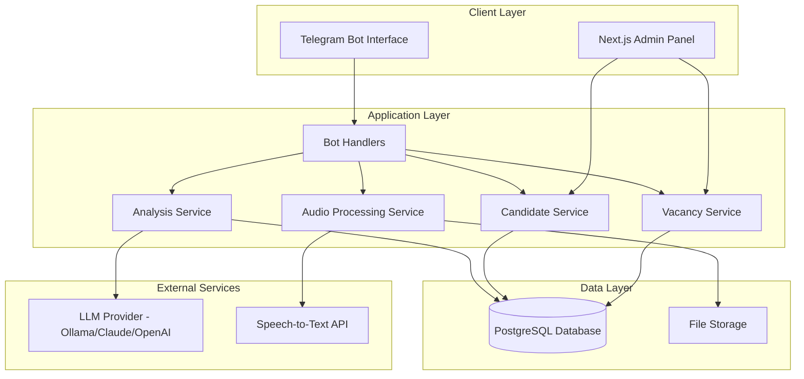
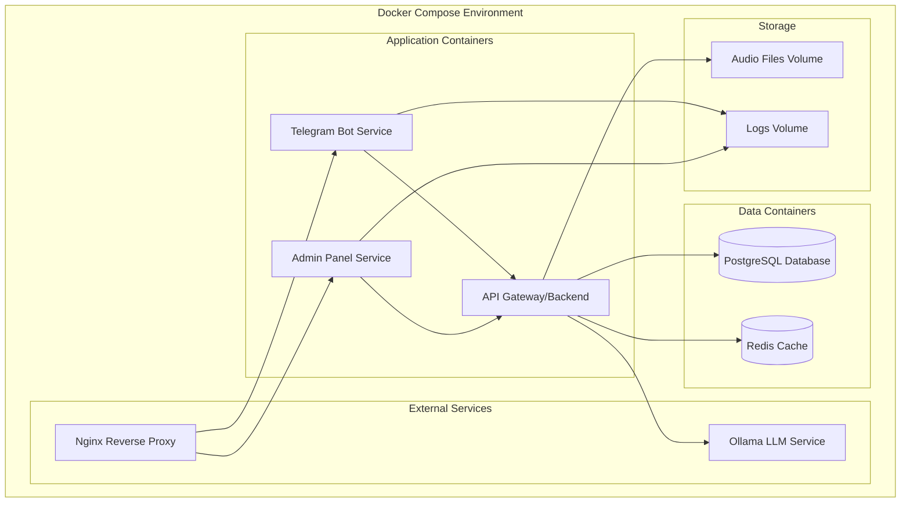

# Design Document

## Overview

The AI HR Bot system is designed as a microservices architecture that transforms the existing basic Telegram bot into a comprehensive recruitment platform. The system integrates multiple components: a Telegram bot interface, PostgreSQL database, LLM-powered analysis engine, audio processing capabilities, and a Next.js admin panel.

The architecture follows a modular approach where each component has clearly defined responsibilities and communicates through well-defined APIs. This design ensures scalability, maintainability, and the ability to extend functionality in the future.

## Architecture

### High-Level Architecture



### Component Architecture

The system is organized into distinct layers:

1. **Presentation Layer**: Telegram Bot and Admin Panel interfaces
2. **Business Logic Layer**: Core services handling domain logic
3. **Data Access Layer**: Database repositories and file storage
4. **Integration Layer**: External service connectors

## Components and Interfaces

### Database Schema

```sql
-- Vacancies table
CREATE TABLE vacancies (
    id SERIAL PRIMARY KEY,
    title VARCHAR(255) NOT NULL,
    description TEXT NOT NULL,
    requirements JSONB NOT NULL,
    evaluation_weights JSONB NOT NULL,
    status VARCHAR(50) DEFAULT 'active',
    created_at TIMESTAMP DEFAULT CURRENT_TIMESTAMP,
    updated_at TIMESTAMP DEFAULT CURRENT_TIMESTAMP
);

-- Candidates table
CREATE TABLE candidates (
    id SERIAL PRIMARY KEY,
    telegram_user_id BIGINT UNIQUE NOT NULL,
    first_name VARCHAR(255),
    last_name VARCHAR(255),
    username VARCHAR(255),
    created_at TIMESTAMP DEFAULT CURRENT_TIMESTAMP
);

-- Dialogues table
CREATE TABLE dialogues (
    id SERIAL PRIMARY KEY,
    candidate_id INTEGER REFERENCES candidates(id),
    vacancy_id INTEGER REFERENCES vacancies(id),
    message_type VARCHAR(50) NOT NULL, -- 'text', 'audio', 'system'
    content TEXT,
    audio_file_path VARCHAR(500),
    transcription TEXT,
    sender VARCHAR(50) NOT NULL, -- 'candidate', 'bot'
    created_at TIMESTAMP DEFAULT CURRENT_TIMESTAMP
);

-- Evaluations table
CREATE TABLE evaluations (
    id SERIAL PRIMARY KEY,
    candidate_id INTEGER REFERENCES candidates(id),
    vacancy_id INTEGER REFERENCES vacancies(id),
    overall_score INTEGER,
    technical_score INTEGER,
    communication_score INTEGER,
    problem_solving_score INTEGER,
    strengths TEXT[],
    gaps TEXT[],
    contradictions TEXT[],
    recommendation VARCHAR(50), -- 'proceed', 'reject', 'clarify'
    feedback TEXT,
    analysis_data JSONB,
    created_at TIMESTAMP DEFAULT CURRENT_TIMESTAMP
);
```

### Core Services

#### VacancyService
```typescript
interface VacancyService {
    createVacancy(vacancy: CreateVacancyDto): Promise<Vacancy>;
    getActiveVacancies(): Promise<Vacancy[]>;
    getVacancyById(id: number): Promise<Vacancy | null>;
    updateVacancy(id: number, updates: UpdateVacancyDto): Promise<Vacancy>;
    deactivateVacancy(id: number): Promise<void>;
}

interface Vacancy {
    id: number;
    title: string;
    description: string;
    requirements: VacancyRequirements;
    evaluationWeights: EvaluationWeights;
    status: 'active' | 'inactive';
    createdAt: Date;
    updatedAt: Date;
}

interface EvaluationWeights {
    technicalSkills: number; // 0-100, default 50
    communication: number;   // 0-100, default 30
    problemSolving: number;  // 0-100, default 20
}
```

#### CandidateService
```typescript
interface CandidateService {
    createOrUpdateCandidate(telegramUser: TelegramUser): Promise<Candidate>;
    getCandidateByTelegramId(telegramUserId: number): Promise<Candidate | null>;
    getCandidateDialogues(candidateId: number, vacancyId?: number): Promise<Dialogue[]>;
    addDialogue(dialogue: CreateDialogueDto): Promise<Dialogue>;
}

interface Candidate {
    id: number;
    telegramUserId: number;
    firstName?: string;
    lastName?: string;
    username?: string;
    createdAt: Date;
}
```

#### AnalysisService
```typescript
interface AnalysisService {
    analyzeCandidate(candidateId: number, vacancyId: number): Promise<Evaluation>;
    generateFeedback(evaluation: Evaluation): Promise<string>;
    extractSkillsFromText(text: string): Promise<string[]>;
}

interface Evaluation {
    id: number;
    candidateId: number;
    vacancyId: number;
    overallScore: number;
    technicalScore: number;
    communicationScore: number;
    problemSolvingScore: number;
    strengths: string[];
    gaps: string[];
    contradictions: string[];
    recommendation: 'proceed' | 'reject' | 'clarify';
    feedback: string;
    analysisData: Record<string, any>;
    createdAt: Date;
}
```

#### AudioProcessingService
```typescript
interface AudioProcessingService {
    processAudioMessage(audioBuffer: Buffer, fileId: string): Promise<AudioProcessingResult>;
    saveAudioFile(buffer: Buffer, filename: string): Promise<string>;
    transcribeAudio(filePath: string): Promise<string>;
}

interface AudioProcessingResult {
    filePath: string;
    transcription: string;
    duration?: number;
    confidence?: number;
}
```

### Admin Panel Architecture (Next.js + TypeScript + Tailwind)

The admin panel is built as a separate Next.js application with the following structure:

```
admin-panel/
├── src/
│   ├── app/                    # App Router (Next.js 13+)
│   │   ├── (auth)/
│   │   │   ├── login/
│   │   │   └── layout.tsx
│   │   ├── dashboard/
│   │   │   ├── page.tsx
│   │   │   └── layout.tsx
│   │   ├── vacancies/
│   │   │   ├── page.tsx
│   │   │   ├── [id]/
│   │   │   ├── create/
│   │   │   └── edit/[id]/
│   │   ├── candidates/
│   │   │   ├── page.tsx
│   │   │   ├── [id]/
│   │   │   └── evaluations/
│   │   ├── reports/
│   │   │   ├── page.tsx
│   │   │   └── analytics/
│   │   ├── api/                # API Routes
│   │   │   ├── auth/
│   │   │   ├── vacancies/
│   │   │   ├── candidates/
│   │   │   └── evaluations/
│   │   ├── globals.css
│   │   └── layout.tsx
│   ├── components/
│   │   ├── ui/                 # Reusable UI components
│   │   │   ├── Button.tsx
│   │   │   ├── Card.tsx
│   │   │   ├── Modal.tsx
│   │   │   ├── Table.tsx
│   │   │   ├── Form.tsx
│   │   │   └── Charts.tsx
│   │   ├── layout/
│   │   │   ├── Sidebar.tsx
│   │   │   ├── Header.tsx
│   │   │   └── Navigation.tsx
│   │   ├── vacancies/
│   │   │   ├── VacancyForm.tsx
│   │   │   ├── VacancyList.tsx
│   │   │   └── VacancyCard.tsx
│   │   ├── candidates/
│   │   │   ├── CandidateList.tsx
│   │   │   ├── CandidateProfile.tsx
│   │   │   └── EvaluationReport.tsx
│   │   └── dashboard/
│   │       ├── StatsCards.tsx
│   │       ├── RecentActivity.tsx
│   │       └── Charts.tsx
│   ├── lib/
│   │   ├── api.ts              # API client
│   │   ├── auth.ts             # Authentication utilities
│   │   ├── utils.ts            # Utility functions
│   │   └── validations.ts      # Form validation schemas
│   ├── types/
│   │   ├── api.ts              # API response types
│   │   ├── auth.ts             # Authentication types
│   │   └── models.ts           # Data model types
│   └── hooks/
│       ├── useAuth.ts
│       ├── useApi.ts
│       └── useLocalStorage.ts
├── public/
├── tailwind.config.js
├── next.config.js
└── package.json
```

#### Key Components Design

**Dashboard Layout**
```typescript
interface DashboardLayoutProps {
  children: React.ReactNode;
}

const DashboardLayout: React.FC<DashboardLayoutProps> = ({ children }) => {
  return (
    <div className="min-h-screen bg-gray-50">
      <Sidebar />
      <div className="lg:pl-64">
        <Header />
        <main className="py-6">
          <div className="mx-auto max-w-7xl px-4 sm:px-6 lg:px-8">
            {children}
          </div>
        </main>
      </div>
    </div>
  );
};
```

**Vacancy Management Interface**
```typescript
interface VacancyFormData {
  title: string;
  description: string;
  requirements: {
    technicalSkills: RequiredSkill[];
    experience: ExperienceRequirement[];
    education?: EducationRequirement[];
    softSkills: string[];
  };
  evaluationWeights: {
    technicalSkills: number;
    communication: number;
    problemSolving: number;
  };
  status: 'active' | 'inactive';
}

const VacancyForm: React.FC<VacancyFormProps> = ({ vacancy, onSubmit }) => {
  const [formData, setFormData] = useState<VacancyFormData>(defaultValues);
  
  return (
    <form onSubmit={handleSubmit} className="space-y-6">
      <Card className="p-6">
        <h3 className="text-lg font-medium mb-4">Basic Information</h3>
        <div className="grid grid-cols-1 gap-6">
          <Input
            label="Job Title"
            value={formData.title}
            onChange={(value) => setFormData({...formData, title: value})}
            required
          />
          <Textarea
            label="Job Description"
            value={formData.description}
            onChange={(value) => setFormData({...formData, description: value})}
            rows={4}
            required
          />
        </div>
      </Card>
      
      <Card className="p-6">
        <h3 className="text-lg font-medium mb-4">Requirements</h3>
        <SkillsEditor
          skills={formData.requirements.technicalSkills}
          onChange={(skills) => updateRequirements('technicalSkills', skills)}
        />
      </Card>
      
      <Card className="p-6">
        <h3 className="text-lg font-medium mb-4">Evaluation Weights</h3>
        <WeightSliders
          weights={formData.evaluationWeights}
          onChange={(weights) => setFormData({...formData, evaluationWeights: weights})}
        />
      </Card>
    </form>
  );
};
```

**Candidate Evaluation Dashboard**
```typescript
interface EvaluationReportProps {
  evaluation: Evaluation;
  candidate: Candidate;
  vacancy: Vacancy;
}

const EvaluationReport: React.FC<EvaluationReportProps> = ({ evaluation, candidate, vacancy }) => {
  return (
    <div className="space-y-6">
      <Card className="p-6">
        <div className="flex items-center justify-between mb-4">
          <h2 className="text-xl font-semibold">Candidate Evaluation</h2>
          <Badge variant={getRecommendationVariant(evaluation.recommendation)}>
            {evaluation.recommendation.toUpperCase()}
          </Badge>
        </div>
        
        <div className="grid grid-cols-1 md:grid-cols-3 gap-4 mb-6">
          <ScoreCard
            title="Overall Score"
            score={evaluation.overallScore}
            className="bg-blue-50 border-blue-200"
          />
          <ScoreCard
            title="Technical Skills"
            score={evaluation.technicalScore}
            className="bg-green-50 border-green-200"
          />
          <ScoreCard
            title="Communication"
            score={evaluation.communicationScore}
            className="bg-purple-50 border-purple-200"
          />
        </div>
        
        <div className="grid grid-cols-1 lg:grid-cols-2 gap-6">
          <div>
            <h3 className="font-medium text-gray-900 mb-2">Strengths</h3>
            <ul className="space-y-1">
              {evaluation.strengths.map((strength, index) => (
                <li key={index} className="flex items-center text-sm text-gray-600">
                  <CheckIcon className="h-4 w-4 text-green-500 mr-2" />
                  {strength}
                </li>
              ))}
            </ul>
          </div>
          
          <div>
            <h3 className="font-medium text-gray-900 mb-2">Areas for Improvement</h3>
            <ul className="space-y-1">
              {evaluation.gaps.map((gap, index) => (
                <li key={index} className="flex items-center text-sm text-gray-600">
                  <XMarkIcon className="h-4 w-4 text-red-500 mr-2" />
                  {gap}
                </li>
              ))}
            </ul>
          </div>
        </div>
      </Card>
      
      <Card className="p-6">
        <h3 className="font-medium text-gray-900 mb-4">Conversation History</h3>
        <ConversationTimeline dialogues={evaluation.dialogues} />
      </Card>
    </div>
  );
};
```

**Analytics Dashboard**
```typescript
const AnalyticsDashboard: React.FC = () => {
  const { data: analytics } = useAnalytics();
  
  return (
    <div className="space-y-6">
      <div className="grid grid-cols-1 md:grid-cols-2 lg:grid-cols-4 gap-4">
        <StatsCard
          title="Active Vacancies"
          value={analytics.activeVacancies}
          change={analytics.vacancyChange}
          icon={BriefcaseIcon}
        />
        <StatsCard
          title="Total Candidates"
          value={analytics.totalCandidates}
          change={analytics.candidateChange}
          icon={UsersIcon}
        />
        <StatsCard
          title="Interviews Completed"
          value={analytics.completedInterviews}
          change={analytics.interviewChange}
          icon={ChatBubbleLeftRightIcon}
        />
        <StatsCard
          title="Success Rate"
          value={`${analytics.successRate}%`}
          change={analytics.successRateChange}
          icon={TrophyIcon}
        />
      </div>
      
      <div className="grid grid-cols-1 lg:grid-cols-2 gap-6">
        <Card className="p-6">
          <h3 className="text-lg font-medium mb-4">Candidate Pipeline</h3>
          <PipelineChart data={analytics.pipelineData} />
        </Card>
        
        <Card className="p-6">
          <h3 className="text-lg font-medium mb-4">Evaluation Scores Distribution</h3>
          <ScoreDistributionChart data={analytics.scoreDistribution} />
        </Card>
      </div>
      
      <Card className="p-6">
        <h3 className="text-lg font-medium mb-4">Recent Activity</h3>
        <ActivityFeed activities={analytics.recentActivities} />
      </Card>
    </div>
  );
};
```

#### Tailwind CSS Design System

**Color Palette**
```css
/* Custom color scheme for HR system */
:root {
  --color-primary-50: #eff6ff;
  --color-primary-500: #3b82f6;
  --color-primary-600: #2563eb;
  --color-success-50: #f0fdf4;
  --color-success-500: #22c55e;
  --color-warning-50: #fffbeb;
  --color-warning-500: #f59e0b;
  --color-danger-50: #fef2f2;
  --color-danger-500: #ef4444;
}
```

**Component Styling Patterns**
```typescript
// Button variants using Tailwind classes
const buttonVariants = {
  primary: "bg-blue-600 hover:bg-blue-700 text-white",
  secondary: "bg-gray-200 hover:bg-gray-300 text-gray-900",
  success: "bg-green-600 hover:bg-green-700 text-white",
  danger: "bg-red-600 hover:bg-red-700 text-white",
};

// Card component with consistent styling
const Card: React.FC<CardProps> = ({ children, className = "" }) => {
  return (
    <div className={`bg-white rounded-lg border border-gray-200 shadow-sm ${className}`}>
      {children}
    </div>
  );
};
```

### Bot Handler Architecture

The bot handlers are redesigned to support the new workflow:

```typescript
class BotHandlers {
    private vacancyService: VacancyService;
    private candidateService: CandidateService;
    private analysisService: AnalysisService;
    private audioService: AudioProcessingService;
    
    // State management for conversation flow
    private userStates: Map<number, UserState>;
    
    async handleStart(msg: Message): Promise<void>;
    async handleVacancySelection(query: CallbackQuery): Promise<void>;
    async handleTextMessage(msg: Message): Promise<void>;
    async handleAudioMessage(msg: Message): Promise<void>;
    async handleEvaluationComplete(candidateId: number, vacancyId: number): Promise<void>;
}

interface UserState {
    currentVacancyId?: number;
    stage: 'selecting_vacancy' | 'interviewing' | 'completed';
    questionCount: number;
    lastActivity: Date;
}
```

## Data Models

### Vacancy Requirements Structure
```typescript
interface VacancyRequirements {
    technicalSkills: RequiredSkill[];
    experience: ExperienceRequirement[];
    education?: EducationRequirement[];
    languages?: LanguageRequirement[];
    softSkills: string[];
}

interface RequiredSkill {
    name: string;
    level: 'beginner' | 'intermediate' | 'advanced' | 'expert';
    mandatory: boolean;
    weight: number; // 1-10
}

interface ExperienceRequirement {
    domain: string;
    minimumYears: number;
    preferred: boolean;
}
```

### Analysis Data Structure
```typescript
interface AnalysisData {
    extractedSkills: ExtractedSkill[];
    experienceAnalysis: ExperienceAnalysis;
    communicationMetrics: CommunicationMetrics;
    redFlags: RedFlag[];
    matchingResults: MatchingResult[];
}

interface ExtractedSkill {
    name: string;
    confidence: number;
    evidence: string[];
    level?: 'beginner' | 'intermediate' | 'advanced' | 'expert';
}

interface CommunicationMetrics {
    clarity: number; // 1-10
    completeness: number; // 1-10
    relevance: number; // 1-10
    professionalTone: number; // 1-10
}
```

## Error Handling

### Error Categories and Responses

1. **Database Errors**
   - Connection failures: Retry with exponential backoff
   - Query errors: Log and return user-friendly messages
   - Transaction failures: Rollback and retry

2. **External Service Errors**
   - Ollama API failures: Fallback to simpler analysis
   - Speech-to-Text failures: Request text input
   - Telegram API errors: Queue messages for retry

3. **Validation Errors**
   - Invalid input: Provide specific guidance
   - Missing data: Request required information
   - Format errors: Show examples

### LLM Provider Integration

The system supports multiple LLM providers with a unified interface:

```typescript
interface LLMService {
    generate(prompt: string, options?: LLMOptions): Promise<string>;
    validateConnection(): Promise<boolean>;
    getModelInfo(): Promise<ModelInfo>;
}

interface LLMOptions {
    maxTokens?: number;
    temperature?: number;
    model?: string;
}

interface ModelInfo {
    name: string;
    provider: 'ollama' | 'claude' | 'openai' | 'azure';
    maxTokens: number;
    supportedFeatures: string[];
}

// Ollama Implementation
class OllamaService implements LLMService {
    async generate(prompt: string, options?: LLMOptions): Promise<string> {
        const response = await fetch(`${this.baseUrl}/api/generate`, {
            method: 'POST',
            headers: { 'Content-Type': 'application/json' },
            body: JSON.stringify({
                model: options?.model || this.model,
                prompt: prompt,
                stream: false,
                options: {
                    temperature: options?.temperature || 0.7,
                    num_predict: options?.maxTokens || 2048
                }
            })
        });
        const data = await response.json();
        return data.response;
    }
}

// Claude Implementation
class ClaudeService implements LLMService {
    async generate(prompt: string, options?: LLMOptions): Promise<string> {
        const response = await fetch('https://api.anthropic.com/v1/messages', {
            method: 'POST',
            headers: {
                'Content-Type': 'application/json',
                'x-api-key': this.apiKey,
                'anthropic-version': '2023-06-01'
            },
            body: JSON.stringify({
                model: options?.model || 'claude-3-sonnet-20240229',
                max_tokens: options?.maxTokens || 2048,
                temperature: options?.temperature || 0.7,
                messages: [{ role: 'user', content: prompt }]
            })
        });
        const data = await response.json();
        return data.content[0].text;
    }
}

// OpenAI Implementation
class OpenAIService implements LLMService {
    async generate(prompt: string, options?: LLMOptions): Promise<string> {
        const response = await fetch('https://api.openai.com/v1/chat/completions', {
            method: 'POST',
            headers: {
                'Content-Type': 'application/json',
                'Authorization': `Bearer ${this.apiKey}`
            },
            body: JSON.stringify({
                model: options?.model || 'gpt-4',
                max_tokens: options?.maxTokens || 2048,
                temperature: options?.temperature || 0.7,
                messages: [{ role: 'user', content: prompt }]
            })
        });
        const data = await response.json();
        return data.choices[0].message.content;
    }
}

// LLM Factory
class LLMFactory {
    static create(provider: string, config: any): LLMService {
        switch (provider) {
            case 'ollama':
                return new OllamaService(config);
            case 'claude':
                return new ClaudeService(config);
            case 'openai':
                return new OpenAIService(config);
            default:
                throw new Error(`Unsupported LLM provider: ${provider}`);
        }
    }
}
```

### Error Handling Strategy

```typescript
class ErrorHandler {
    static async handleDatabaseError(error: DatabaseError, context: string): Promise<void>;
    static async handleExternalServiceError(error: ServiceError, fallback?: () => Promise<any>): Promise<any>;
    static async handleValidationError(error: ValidationError): Promise<string>;
    static async handleLLMError(error: LLMError, provider: string): Promise<string>;
}

interface ErrorResponse {
    success: false;
    error: {
        code: string;
        message: string;
        details?: any;
    };
}

interface LLMError extends Error {
    provider: string;
    statusCode?: number;
    rateLimited?: boolean;
    quotaExceeded?: boolean;
}
```

## Testing Strategy

### Unit Testing
- Service layer methods with mocked dependencies
- Data validation and transformation functions
- Error handling scenarios
- Business logic components

### Integration Testing
- Database operations with test database
- External API integrations with mock services
- End-to-end conversation flows
- File upload and processing workflows

### Test Structure
```typescript
describe('VacancyService', () => {
    describe('createVacancy', () => {
        it('should create vacancy with valid data');
        it('should validate required fields');
        it('should handle database errors');
    });
});

describe('Bot Integration', () => {
    it('should handle complete interview flow');
    it('should process audio messages correctly');
    it('should generate appropriate evaluations');
});
```

### Performance Testing
- Database query optimization
- Large file processing capabilities
- Concurrent user handling
- Memory usage monitoring

### Security Testing
- Input validation and sanitization
- SQL injection prevention
- Authentication and authorization
- Data encryption verification

## Docker Containerization Architecture

### Container Structure

The system is designed to run in a multi-container Docker environment with the following services:



### Docker Configuration Files

**Main Dockerfile (Telegram Bot)**
```dockerfile
FROM node:18-alpine AS base

# Install dependencies only when needed
FROM base AS deps
RUN apk add --no-cache libc6-compat
WORKDIR /app

# Install dependencies based on the preferred package manager
COPY package.json package-lock.json* ./
RUN npm ci --only=production

# Rebuild the source code only when needed
FROM base AS builder
WORKDIR /app
COPY --from=deps /app/node_modules ./node_modules
COPY . .

# Build the application
RUN npm run build

# Production image, copy all the files and run the app
FROM base AS runner
WORKDIR /app

ENV NODE_ENV production

RUN addgroup --system --gid 1001 nodejs
RUN adduser --system --uid 1001 botuser

# Copy built application
COPY --from=builder --chown=botuser:nodejs /app/dist ./dist
COPY --from=builder --chown=botuser:nodejs /app/node_modules ./node_modules
COPY --from=builder --chown=botuser:nodejs /app/package.json ./package.json

# Create directories for file storage
RUN mkdir -p /app/storage/audio && chown -R botuser:nodejs /app/storage

USER botuser

EXPOSE 3000

ENV PORT 3000

CMD ["node", "dist/app.js"]
```

**Admin Panel Dockerfile**
```dockerfile
FROM node:18-alpine AS base

# Install dependencies only when needed
FROM base AS deps
RUN apk add --no-cache libc6-compat
WORKDIR /app

COPY admin-panel/package.json admin-panel/package-lock.json* ./
RUN npm ci --only=production

# Rebuild the source code only when needed
FROM base AS builder
WORKDIR /app
COPY --from=deps /app/node_modules ./node_modules
COPY admin-panel/ .

ENV NEXT_TELEMETRY_DISABLED 1

RUN npm run build

# Production image, copy all the files and run Next.js
FROM base AS runner
WORKDIR /app

ENV NODE_ENV production
ENV NEXT_TELEMETRY_DISABLED 1

RUN addgroup --system --gid 1001 nodejs
RUN adduser --system --uid 1001 nextjs

COPY --from=builder /app/public ./public
COPY --from=builder --chown=nextjs:nodejs /app/.next/standalone ./
COPY --from=builder --chown=nextjs:nodejs /app/.next/static ./.next/static

USER nextjs

EXPOSE 3000

ENV PORT 3000
ENV HOSTNAME "0.0.0.0"

CMD ["node", "server.js"]
```

**Docker Compose Configuration**
```yaml
version: '3.8'

services:
  # PostgreSQL Database
  postgres:
    image: postgres:15-alpine
    container_name: hr-bot-postgres
    environment:
      POSTGRES_DB: ${DB_NAME:-hr_bot}
      POSTGRES_USER: ${DB_USER:-hr_user}
      POSTGRES_PASSWORD: ${DB_PASSWORD}
    volumes:
      - postgres_data:/var/lib/postgresql/data
      - ./database/init:/docker-entrypoint-initdb.d
    ports:
      - "5432:5432"
    networks:
      - hr-bot-network
    healthcheck:
      test: ["CMD-SHELL", "pg_isready -U ${DB_USER:-hr_user} -d ${DB_NAME:-hr_bot}"]
      interval: 30s
      timeout: 10s
      retries: 3

  # Redis Cache
  redis:
    image: redis:7-alpine
    container_name: hr-bot-redis
    command: redis-server --appendonly yes
    volumes:
      - redis_data:/data
    ports:
      - "6379:6379"
    networks:
      - hr-bot-network
    healthcheck:
      test: ["CMD", "redis-cli", "ping"]
      interval: 30s
      timeout: 10s
      retries: 3

  # Ollama LLM Service
  ollama:
    image: ollama/ollama:latest
    container_name: hr-bot-ollama
    volumes:
      - ollama_data:/root/.ollama
    ports:
      - "11434:11434"
    networks:
      - hr-bot-network
    environment:
      - OLLAMA_HOST=0.0.0.0
    healthcheck:
      test: ["CMD", "curl", "-f", "http://localhost:11434/api/tags"]
      interval: 30s
      timeout: 10s
      retries: 3

  # Telegram Bot Service
  telegram-bot:
    build:
      context: .
      dockerfile: Dockerfile
    container_name: hr-bot-telegram
    environment:
      - NODE_ENV=production
      - TELEGRAM_BOT_TOKEN=${TELEGRAM_BOT_TOKEN}
      - DATABASE_URL=postgresql://${DB_USER:-hr_user}:${DB_PASSWORD}@postgres:5432/${DB_NAME:-hr_bot}
      - REDIS_URL=redis://redis:6379
      - OLLAMA_BASE_URL=http://ollama:11434
      - OLLAMA_MODEL=${OLLAMA_MODEL:-gemma2:latest}
      - SPEECH_TO_TEXT_API_KEY=${SPEECH_TO_TEXT_API_KEY}
      - AUDIO_STORAGE_PATH=/app/storage/audio
    volumes:
      - audio_files:/app/storage/audio
      - bot_logs:/app/logs
    depends_on:
      postgres:
        condition: service_healthy
      redis:
        condition: service_healthy
      ollama:
        condition: service_healthy
    networks:
      - hr-bot-network
    restart: unless-stopped

  # Admin Panel Service
  admin-panel:
    build:
      context: .
      dockerfile: admin-panel/Dockerfile
    container_name: hr-bot-admin
    environment:
      - NODE_ENV=production
      - DATABASE_URL=postgresql://${DB_USER:-hr_user}:${DB_PASSWORD}@postgres:5432/${DB_NAME:-hr_bot}
      - NEXTAUTH_SECRET=${NEXTAUTH_SECRET}
      - NEXTAUTH_URL=${NEXTAUTH_URL:-http://localhost:3001}
      - API_BASE_URL=http://telegram-bot:3000
    ports:
      - "3001:3000"
    depends_on:
      postgres:
        condition: service_healthy
      telegram-bot:
        condition: service_started
    networks:
      - hr-bot-network
    restart: unless-stopped

  # Nginx Reverse Proxy
  nginx:
    image: nginx:alpine
    container_name: hr-bot-nginx
    ports:
      - "80:80"
      - "443:443"
    volumes:
      - ./nginx/nginx.conf:/etc/nginx/nginx.conf
      - ./nginx/ssl:/etc/nginx/ssl
    depends_on:
      - admin-panel
    networks:
      - hr-bot-network
    restart: unless-stopped

volumes:
  postgres_data:
  redis_data:
  ollama_data:
  audio_files:
  bot_logs:

networks:
  hr-bot-network:
    driver: bridge
```

**Environment Configuration (.env.production)**
```bash
# Database Configuration
DB_NAME=hr_bot
DB_USER=hr_user
DB_PASSWORD=your_secure_password_here

# Telegram Bot Configuration
TELEGRAM_BOT_TOKEN=your_telegram_bot_token_here

# LLM Configuration
LLM_PROVIDER=claude  # Options: ollama, claude, openai, azure
LLM_MODEL=claude-3-sonnet-20240229
LLM_API_KEY=your_claude_api_key_here  # Required for external providers
LLM_MAX_TOKENS=2048
LLM_TEMPERATURE=0.7

# Ollama Configuration (only if LLM_PROVIDER=ollama)
OLLAMA_BASE_URL=http://ollama:11434

# Speech-to-Text Configuration
SPEECH_TO_TEXT_PROVIDER=google
SPEECH_TO_TEXT_API_KEY=your_speech_api_key_here

# Admin Panel Configuration
NEXTAUTH_SECRET=your_nextauth_secret_here
NEXTAUTH_URL=http://localhost:3001

# Security
JWT_SECRET=your_jwt_secret_here

# Redis Configuration
REDIS_URL=redis://redis:6379
REDIS_TTL=3600NAME=hr_bot
DB_USER=hr_user
DB_PASSWORD=your_secure_password_here

# Telegram Bot Configuration
TELEGRAM_BOT_TOKEN=your_telegram_bot_token_here

# Ollama Configuration
OLLAMA_MODEL=gemma2:latest

# Speech-to-Text Configuration
SPEECH_TO_TEXT_PROVIDER=google
SPEECH_TO_TEXT_API_KEY=your_speech_api_key_here

# Admin Panel Configuration
NEXTAUTH_SECRET=your_nextauth_secret_here
NEXTAUTH_URL=http://localhost:3001

# Security
JWT_SECRET=your_jwt_secret_here
```

**Nginx Configuration**
```nginx
events {
    worker_connections 1024;
}

http {
    upstream admin_panel {
        server admin-panel:3000;
    }

    server {
        listen 80;
        server_name localhost;

        # Admin Panel
        location / {
            proxy_pass http://admin_panel;
            proxy_set_header Host $host;
            proxy_set_header X-Real-IP $remote_addr;
            proxy_set_header X-Forwarded-For $proxy_add_x_forwarded_for;
            proxy_set_header X-Forwarded-Proto $scheme;
        }

        # Health check endpoint
        location /health {
            access_log off;
            return 200 "healthy\n";
            add_header Content-Type text/plain;
        }
    }
}
```

### Development Docker Configuration

**docker-compose.dev.yml**
```yaml
version: '3.8'

services:
  postgres:
    extends:
      file: docker-compose.yml
      service: postgres
    ports:
      - "5432:5432"

  redis:
    extends:
      file: docker-compose.yml
      service: redis
    ports:
      - "6379:6379"

  ollama:
    extends:
      file: docker-compose.yml
      service: ollama
    ports:
      - "11434:11434"

  telegram-bot:
    build:
      context: .
      dockerfile: Dockerfile.dev
    container_name: hr-bot-telegram-dev
    environment:
      - NODE_ENV=development
      - TELEGRAM_BOT_TOKEN=${TELEGRAM_BOT_TOKEN}
      - DATABASE_URL=postgresql://${DB_USER:-hr_user}:${DB_PASSWORD}@postgres:5432/${DB_NAME:-hr_bot}
      - REDIS_URL=redis://redis:6379
      - OLLAMA_BASE_URL=http://ollama:11434
    volumes:
      - .:/app
      - /app/node_modules
      - audio_files:/app/storage/audio
    ports:
      - "3000:3000"
    command: npm run dev
    depends_on:
      - postgres
      - redis
      - ollama
    networks:
      - hr-bot-network

  admin-panel:
    build:
      context: ./admin-panel
      dockerfile: Dockerfile.dev
    container_name: hr-bot-admin-dev
    environment:
      - NODE_ENV=development
      - DATABASE_URL=postgresql://${DB_USER:-hr_user}:${DB_PASSWORD}@postgres:5432/${DB_NAME:-hr_bot}
    volumes:
      - ./admin-panel:/app
      - /app/node_modules
    ports:
      - "3001:3000"
    command: npm run dev
    depends_on:
      - postgres
    networks:
      - hr-bot-network
```

## Configuration Management

### Environment Variables
```typescript
interface Config {
    database: {
        host: string;
        port: number;
        name: string;
        username: string;
        password: string;
        ssl: boolean;
    };
    telegram: {
        token: string;
        webhookUrl?: string;
    };
    llm: {
        provider: 'ollama' | 'claude' | 'openai' | 'azure';
        // Ollama configuration
        baseUrl?: string;
        model: string;
        timeout: number;
        // External LLM configuration
        apiKey?: string;
        region?: string;
        maxTokens?: number;
        temperature?: number;
    };
    speechToText: {
        provider: 'google' | 'azure' | 'aws';
        apiKey: string;
        region?: string;
    };
    storage: {
        audioFilesPath: string;
        maxFileSize: number;
    };
    admin: {
        jwtSecret: string;
        sessionTimeout: number;
    };
    redis: {
        url: string;
        ttl: number;
    };
}
```

### Docker Deployment Scripts

**scripts/deploy.sh**
```bash
#!/bin/bash
set -e

echo "🚀 Deploying HR Bot System..."

# Pull latest images
docker-compose pull

# Build and start services
docker-compose up -d --build

# Wait for services to be healthy
echo "⏳ Waiting for services to be ready..."
docker-compose exec postgres pg_isready -U hr_user -d hr_bot
docker-compose exec redis redis-cli ping

# Run database migrations
echo "📊 Running database migrations..."
docker-compose exec telegram-bot npm run migrate

# Check service health
echo "🔍 Checking service health..."
docker-compose ps

echo "✅ Deployment complete!"
```

This design provides a robust, scalable, and maintainable Docker-based deployment architecture for the comprehensive AI HR Bot system.